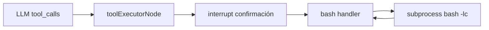

# Plan: herramienta `bash` (servidor Node)

## Contexto encajado en el repo

- Las tools se declaran en [`packages/agent/src/tools/catalog.ts`](projects/10x-builders-agent/packages/agent/src/tools/catalog.ts) y se implementan en [`packages/agent/src/tools/adapters.ts`](projects/10x-builders-agent/packages/agent/src/tools/adapters.ts) con `tool()` + Zod.
- Con `risk: "high"`, [`toolExecutorNode`](projects/10x-builders-agent/packages/agent/src/graph.ts) ya hace **interrupt + confirmación** antes de invocar la tool (mismo patrón que `github_create_repo` / `gcal_delete_event`): la implementación de `bash` **no** debe llamar a `createToolCall` dentro del handler.
- “Abrir terminal nueva / existente”: en backend no hay ventana de Terminal. Lo razonable es **una shell nueva por llamada**: `execFile("/bin/bash", ["-lc", command], …)` hereda el entorno del proceso Node y termina al acabar el comando (sin sesión interactiva persistente entre llamadas). Si más adelante quisierais estado entre comandos (`cd`, variables), habría que diseñar un shell persistente por sesión (PTY), fuera del alcance mínimo.

## Persistencia (qué sí y qué no)

- **No hay persistencia de estado de shell** entre llamadas a la tool: cada prompt/comando corre en un **proceso nuevo** con `bash -lc '<command>'` (o equivalente con argumentos seguros). Exportaciones, `cd` internos al comando y variables solo viven dentro de esa única ejecución del `-lc`.
- **Correlación “lógica” entre comandos** no la guarda el servidor en un REPL; la reproduce el modelo y el usuario repitiendo el mismo ancla:
  - **`cwd` opcional** = **carpeta base** del subproceso (`options.cwd` de Node). Sirve para agrupar ejecuciones “en el mismo repo/proyecto” sin tener que prefijar todo el comando con `cd … &&`. No sustituye un id opaco de sesión shell.
  - **Correlación para auditoría**: el grafo ya persiste la tool call en BD (`tool_calls` / HITL); el `sessionId` del contexto ya correlaciona turnos. No hace falta un parámetro extra `correlation_id` salvo que quieras exponerlo explícitamente al modelo (opcional, no imprescindible).
- **Seguridad de rutas (recomendado en el plan de implementación)**: si `cwd` se admite, validar que la ruta resuelta quede bajo un **root permitido** (p. ej. `BASH_WORKSPACE_ROOT` o similar) para evitar `cwd` arbitrario fuera de workspaces controlados en multiusuario.

## Cambios concretos

1. **Catálogo** — Entrada nueva `id`/`name`: `bash`, `risk: "high"`, sin `requires_integration`. Descripción alineada con la tuya (unix-like). `parameters_schema`: `command` (string, obligatorio); `cwd` (string, opcional) = directorio de trabajo para esa sola invocación (carpeta base); documentar en descripción que **no** mantiene shell entre llamadas.

2. **Ejecución** — Nuevo módulo pequeño (recomendado) ej. `packages/agent/src/tools/bash-exec.ts` que use `node:child_process` (`execFile` o `spawn` + acumular buffers):
   - Invocación fija: **`/bin/bash` + `-lc` + el comando** (el string del usuario como único script de login non-interactive para esa ejecución).
   - Si viene `cwd`: `path.resolve` respecto a un default seguro + comprobación `existsSync` + directorio; opcionalmente **sandbox de prefijo** con variable de entorno del servidor.
   - Solo si `process.platform !== "win32"` (o comprobar existencia de `/bin/bash`); si no, devolver error claro (“solo unix-like”).
   - **Timeout** (p. ej. 60–120 s configurable por constante).
   - **Límite de salida** (truncar stdout/stderr si supera N caracteres para no reventar contexto del modelo ni memoria).
   - Devolver JSON serializable: `{ stdout, stderr, exitCode, cwd?: string, truncated?: boolean }` (el handler LangChain puede hacer `JSON.stringify` como el resto de tools; incluir `cwd` efectivo ayuda a correlacionar en el historial del modelo).

3. **Adapters** — En `buildLangChainTools`, bloque `if (isBashToolAllowed() && isToolAvailable("bash", ctx))` con schema Zod (`command` obligatorio, `cwd` opcional). La descripción para el modelo debe dejar claro: cada llamada = proceso nuevo `bash -lc`; `cwd` solo fija la carpeta base de esa ejecución.

4. **Resumen HITL** — En `summariseToolCall`, rama `bash`: texto corto tipo “Ejecutar comando bash (cwd: …): …” con **truncado** del comando; si hay `cwd`, mostrarlo truncado para correlación visual en la tarjeta de confirmación.

5. **UI / settings** — Incluir `bash` en la lista `TOOL_IDS` de [`apps/web/src/app/settings/settings-form.tsx`](projects/10x-builders-agent/apps/web/src/app/settings/settings-form.tsx) para poder habilitar/deshabilitar. Decisión de producto: **no** añadirlo al onboarding por defecto ([`step-tools.tsx`](projects/10x-builders-agent/apps/web/src/app/onboarding/steps/step-tools.tsx) / [`wizard.tsx`](projects/10x-builders-agent/apps/web/src/app/onboarding/wizard.tsx)) salvo que quieras que usuarios nuevos lo vean explícitamente (riesgo alto). Si `ALLOW_BASH_TOOL` no está activo en el servidor, la tool **no debe aparecer en `buildLangChainTools`** aunque el usuario la tenga marcada en BD (comportamiento seguro); opcionalmente la UI puede mostrar la fila deshabilitada con texto tipo “requiere ALLOW_BASH_TOOL en el servidor” — solo si merece la pena el trabajo en cliente.

## Variable de entorno `ALLOW_BASH_TOOL` (control explícito)

- **Sí**: es una **variable de entorno** leída por el proceso Node que ejecuta el agente (Next.js server, webhook de Telegram, etc.), **igual en local que en producción**.
- **Semántica recomendada**: la tool `bash` solo se construye y expone al modelo cuando el flag está activo (p. ej. `ALLOW_BASH_TOOL=true` o `1`; cualquier otro valor o ausencia = desactivado). Así evitas ejecutar subshell por accidente en un `npm run dev` olvidado.
- **Implementación**: helper único ej. `isBashToolAllowed()` que lea `process.env.ALLOW_BASH_TOOL` y úsalo en `buildLangChainTools` (no registrar el bloque `bash` si es false). Opcionalmente duplicar la comprobación al inicio del handler por defensa en profundidad.
- **Local**: añadir `ALLOW_BASH_TOOL=true` en `.env.local` (o export en la shell) solo cuando quieras probar la tool; por defecto sin variable = sin bash expuesto.

## Archivos principales a tocar

- [`packages/agent/src/tools/catalog.ts`](projects/10x-builders-agent/packages/agent/src/tools/catalog.ts)
- [`packages/agent/src/tools/adapters.ts`](projects/10x-builders-agent/packages/agent/src/tools/adapters.ts)
- Nuevo: `packages/agent/src/tools/bash-exec.ts` (o nombre equivalente)
- [`apps/web/src/app/settings/settings-form.tsx`](projects/10x-builders-agent/apps/web/src/app/settings/settings-form.tsx)
- Helper pequeño para `ALLOW_BASH_TOOL` (mismo paquete `agent`, importado desde `adapters.ts`)

## Tests / smoke

- Script o test manual: invocar la tool con un comando inofensivo (`echo ok`) y verificar JSON + límites; en CI mac/linux suele haber `/bin/bash`.
