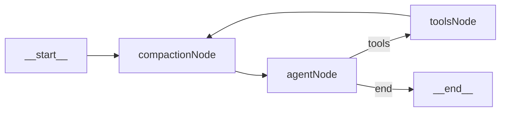
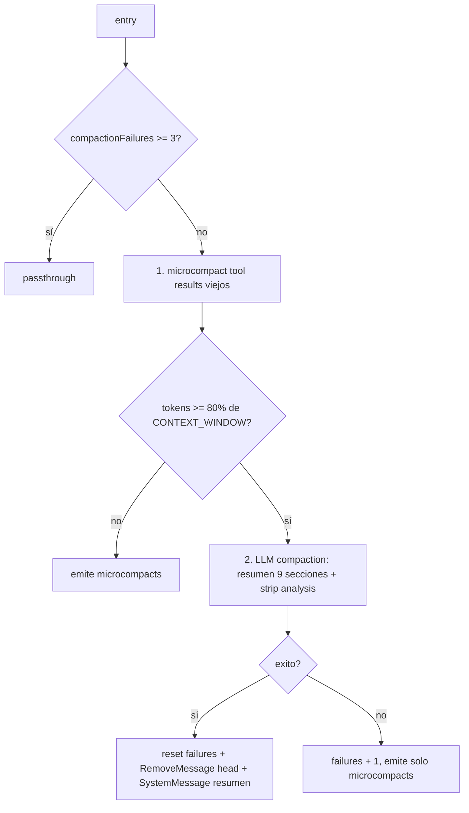

# Plan — Memoria a corto plazo del agente (compaction_node)

## Contexto y objetivo

El agente no tenía un mecanismo explícito de **memoria a corto plazo**. El historial se gestionaba por dos caminos descoordinados:

- Al iniciar un turno, `runAgent` cargaba los **últimos 15 mensajes** desde la DB (`graph.ts`).
- Dentro del turno, el reducer de `messages` era **append puro** (`(prev, next) => [...prev, ...next]`): cada loop `agent → tools → agent` añadía `AIMessage` con `tool_calls` + `ToolMessage` con el resultado. Con `MAX_TOOL_ITERATIONS = 6` y tools como `bash` o `gcal_list_events` que devuelven respuestas grandes, el array crecía rápido.

Esto producía **Context Rot**: el modelo recibía cada vez más tokens, mucho de ellos resultados de tool ya consumidos, lo que degrada respuesta y costo.

Solución: introducir un `compaction_node` transparente que actúa como la **memoria a corto plazo** del agente. Cada vez que la conversación pasa por él decide si limpiar resultados de tool viejos (microcompact) y/o resumir el historial entero (LLM compaction). Es invisible para `agent_node`, `toolExecutorNode`, HITL, `iterationCount` y checkpointer.

## Decisiones cerradas

| Decisión | Elegido | Por qué |
|---|---|---|
| Reducer de `messages` | `messagesStateReducer` oficial de `@langchain/langgraph` | Soporta `RemoveMessage(id)` y dedupe por id — patrón canónico para reemplazar/borrar mensajes desde un nodo. Sin él, compaction nunca podría reducir el array. |
| Modelo de compactación | Env var `OPENROUTER_COMPACTION_MODEL` + factory `createCompactionModel()` en `model.ts` | Permite usar un modelo distinto al principal sin tocar `createChatModel()`. Restricción `:free` se mantiene. |
| Medición de tokens | Heurística `chars / 4` | Sin dependencias nuevas. El threshold 80% deja 20% de buffer; la estimación cabe holgada. Migrable a `gpt-tokenizer` en una sola función. |
| Ventana de contexto | Constante `CONTEXT_WINDOW = 64_000` | Punto medio: aprovecha la ventana de los `:free` modernos sin atarse a los 128k del modelo actual. Si OpenRouter rota a un slug con menos contexto, no revienta. |
| Threshold compaction LLM | `COMPACTION_THRESHOLD = 0.8` (80%) | El propio proceso de compactación debe caber en la ventana. 80% deja margen para el resumen + system prompt + último turno. |
| Cola preservada (microcompact) | Últimos **5** `ToolMessage` íntegros | Los más recientes son los que el modelo aún puede necesitar; los anteriores ya fueron consumidos y resumidos por el propio modelo en sus respuestas. |
| Cola preservada (LLM compaction) | Últimos **7** mensajes no-system (`TAIL_TURNS_TO_KEEP`) | Mantiene continuidad operativa más allá de los puros tool results: incluye los AIMessages y HumanMessages recientes. |
| Circuit breaker | 3 fallos consecutivos → passthrough | Evita loop infinito si el modelo de compactación falla (rate limit, error, malformed output). El agente sigue funcionando aunque sin compactar. |
| Topología | `__start__ → compaction → agent → (tools \| __end__)`, `tools → compaction → agent` | Edge crítico: `tools → compaction` (no `tools → agent`). Cada tool result entra al compactor antes de llegar al modelo. |

## Topología



Cada turno comienza pasando por compaction (microcompact + LLM compaction si aplica), luego ejecuta el ciclo `agent ↔ tools` normal con compaction interpuesto entre `tools` y `agent` para limpiar resultados antes de re-invocar al modelo.

### Etapas internas del nodo



## Cómo funciona el reemplazo de mensajes

`messagesStateReducer` (el reducer estándar de `@langchain/langgraph`) trata `messages` así:

- Si llega un mensaje **sin** id existente → lo añade al final.
- Si llega un mensaje con un id que **ya existe** → reemplaza la entrada original.
- Si llega un `RemoveMessage(id)` → elimina la entrada con ese id.

Para que esto funcione, **todos los mensajes deben tener id**. `runAgent` asigna `randomUUID()` a cada `SystemMessage`, `HumanMessage` y `AIMessage` que construye al cargar historial desde la DB; los `AIMessage` que devuelve el modelo y los `ToolMessage` que crea `toolExecutorNode` ya traen id de `@langchain/core`.

Si por alguna razón un mensaje viejo no tiene id (legado, edge case), `compaction_node` lo **omite** del cleanup en vez de fallar.

## Microcompact (etapa 1, gratis)

Operación local sin llamada al LLM:

```
toolMessages = state.messages.filter(m => m instanceof ToolMessage)
toClear      = toolMessages.slice(0, length - TOOL_RESULTS_TO_PRESERVE)

para cada toolMessage con id en toClear:
  emit ToolMessage({ id: mismo, content: "[tool result cleared]", tool_call_id })
```

El reducer reemplaza la entrada vieja por la nueva (mismo id). Si el array ya tiene ≤ 5 ToolMessages, no se emite nada. Idempotente: si el mensaje ya es `[tool result cleared]`, se salta.

## Evaluación de threshold

Tras aplicar el microcompact en una proyección local del state:

```
tokens = Σ(length(content) / 4) sobre todos los mensajes proyectados
```

Si `tokens < CONTEXT_WINDOW * COMPACTION_THRESHOLD` (≈ 51_200), devuelve solo los microcompacts y termina.

Si lo supera, pasa a la etapa 2.

## LLM compaction (etapa 2)

Conserva intactos:

- Todos los `SystemMessage` (incluye el system prompt y posibles resúmenes previos).
- Los últimos `TAIL_TURNS_TO_KEEP = 7` mensajes no-system.

Resume el `head` restante invocando `createCompactionModel()` con un prompt que pide **9 secciones obligatorias**:

1. Objetivo declarado del usuario
2. Decisiones tomadas
3. Datos extraídos de tool calls
4. Acciones ejecutadas exitosamente
5. Acciones rechazadas o fallidas
6. Estado actual de las integraciones
7. Preguntas pendientes del agente al usuario
8. Restricciones o preferencias declaradas
9. Próximo paso lógico

La respuesta del modelo pasa por `stripAnalysisBlocks()` que elimina cualquier `<analysis>...</analysis>` por defensa (algunos modelos los emiten cuando se les pide razonar antes de responder).

Output del nodo: `RemoveMessage(id)` por cada mensaje del head + un `SystemMessage` nuevo con `Resumen de contexto previo (compactado):\n\n<cleaned>`.

## Circuit breaker

`GraphState` lleva `compactionFailures: number`. Cuando el `try/catch` de la etapa 2 falla (o devuelve resumen vacío tras strip), incrementa el contador. Si la etapa 2 tiene éxito, **lo resetea a 0**.

Si `compactionFailures >= 3` al entrar al nodo, hace passthrough sin tocar `messages`. El agente sigue funcionando con el historial completo (degradado pero no roto).

## Archivos creados/modificados

| Archivo | Tipo | Cambios |
|---|---|---|
| `packages/agent/src/state.ts` | NUEVO | `GraphState` con `messagesStateReducer` + `compactionFailures`. |
| `packages/agent/src/nodes/compaction_node.ts` | NUEVO | Microcompact + LLM compaction + circuit breaker. |
| `packages/agent/src/model.ts` | MOD | Añade `createCompactionModel()`. |
| `packages/agent/src/graph.ts` | MOD | Importa GraphState, asigna ids a mensajes iniciales, recablea topología, pasa `compactionFailures: 0`. |
| `apps/web/.env.example` | MOD | Documenta `OPENROUTER_COMPACTION_MODEL`. |
| `docs/architecture.md` | MOD | Subsección "Memoria a corto plazo (compaction_node)" en la sección LangGraph. |
| `README.md` | MOD | Variable de entorno + enlace a este doc. |
| `CHANGELOG.md` | MOD | Entrada en `[Unreleased] → Added`. |

## Validación

### Automatizada (smoke script)

`packages/agent/scripts/smoke-compaction.ts` — corre con `npx tsx`. Cubre todo lo determinístico (sin invocar al LLM real):

- `stripAnalysisBlocks`: 6 casos (sin bloques, uno, varios, case-insensitive, multilinea, solo bloque → vacío).
- Microcompact con 7 ToolMessages: emite exactamente 2 reemplazos de los más viejos, los últimos 5 quedan íntegros, ids correctos, `compactionFailures` se resetea a 0.
- Microcompact idempotente: si los viejos ya están `[tool result cleared]`, no re-emite.
- Microcompact con ≤ 5 ToolMessages: no emite nada.
- Circuit breaker: `compactionFailures >= 3` ⇒ devuelve `{}` (passthrough).
- Threshold no cruzado: no invoca al LLM, no lanza.
- Threshold cruzado + `OPENROUTER_COMPACTION_MODEL` ausente: el `try/catch` captura el error, `compactionFailures` pasa a 1, no se emiten `RemoveMessage`.

### Manual (pendiente, requiere LLM real)

- **Happy path LLM compaction:** con `OPENROUTER_API_KEY` y `OPENROUTER_COMPACTION_MODEL` (slug `:free`) válidos, forzar conversación larga en `/chat`. Verificar log `[compactionNode] LLM compaction applied` + `SystemMessage("Resumen de contexto previo (compactado): ...")` en el state.
- **Persistencia tras compactación:** abrir el thread en un siguiente turno (resume HITL) y confirmar que el state cargado refleja la compactación (no se "deshace" al rehidratar desde `PostgresSaver`).

## Trade-offs descartados

- **Reducer custom con marcador propio**: funciona pero es convención casera; `messagesStateReducer` ya está probado.
- **`gpt-tokenizer` desde el día 1**: 1.5MB extra para precisión que el buffer del 20% absorbe.
- **Hardcodear ventana = 128_000**: ata al modelo actual; rotaciones de `:free` con menos contexto romperían el agente.
- **Env vars para `THRESHOLD` y `CONTEXT_WINDOW`**: prematuro — primero validar el comportamiento con valores fijos; promoverlas a env si se ve la necesidad.

## Riesgos

- **Mensajes sin `id`**: legados de migraciones futuras o llamadas externas a `runAgent`. Mitigación: `compaction_node` los omite del cleanup en vez de fallar.
- **Estimación `chars/4` subestima JSON denso** (tool results con muchos delimitadores). Mitigación: el buffer del 20% absorbe la imprecisión esperada para los volúmenes del agente.
- **Interacción con checkpointer**: `PostgresSaver` debe persistir correctamente los `RemoveMessage` aplicados. Validar en el test manual 2 abriendo el thread en un siguiente turno.
- **Resume HITL atravesando compaction**: tras un `interrupt()` resuelto, la ejecución pasa por compaction antes de volver a `agent`. La cola de 7 mensajes preservados cubre el `ToolMessage` recién aprobado.
