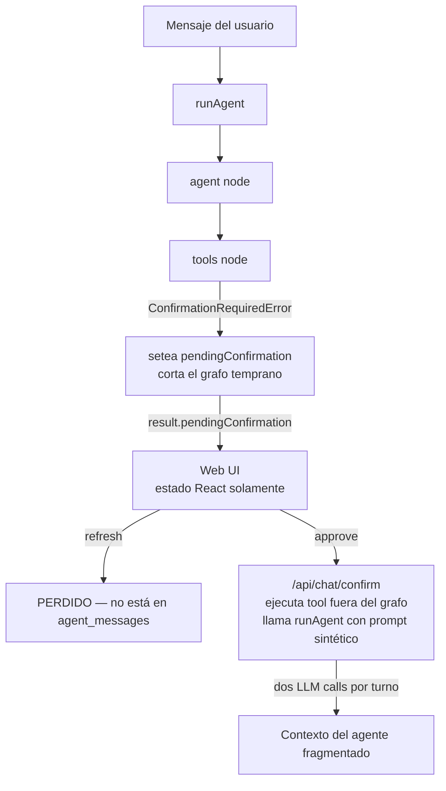
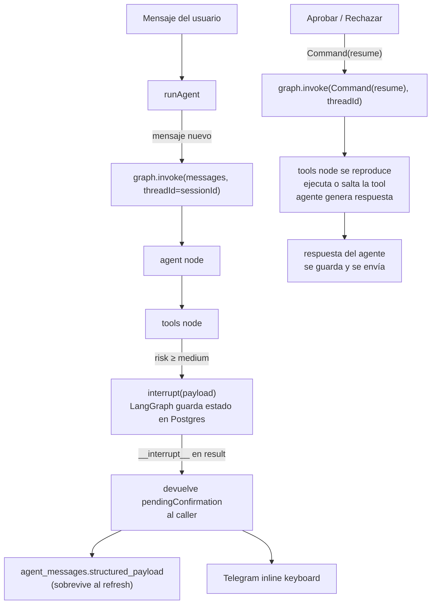

# Plan de Implementación — Human in the Loop (HITL) con LangGraph nativo

Documento de **planificación**: define cómo migrar el HITL actual (custom, basado en excepción y re-arranque del grafo) a la pauta nativa de LangGraph **`interrupt()` + `Command(resume)`** con persistencia del estado del grafo en Postgres mediante `@langchain/langgraph-checkpoint-postgres`. El `interrupt` se dispara declarativamente desde el `toolExecutorNode` leyendo el campo `risk` del catálogo de tools.

Referencias:

- Doc oficial: <https://docs.langchain.com/oss/javascript/langchain/human-in-the-loop>
- Arquitectura general del agente: [architecture.md](architecture.md)
- Catálogo de tools y niveles de riesgo: `packages/agent/src/tools/catalog.ts`

> **Alcance**: solo afecta a tools con `risk: "medium" | "high"`. Las de riesgo `low` se ejecutan sin pasar por el interrupt.

---

## 1. Arquitectura actual (y por qué se rompe)

### 1.1 Flujo



### 1.2 Problemas concretos

- **Refresh en web pierde el estado**: `pendingConfirmation` solo vive en estado de React. Al recargar, el card de aprobación desaparece aunque el row `tool_calls` siga vivo.
- **Telegram ejecuta fuera del grafo**: la rama `callback_query` llama `executeApprovedToolCall` directamente y luego un `runAgent` con un prompt sintético — el grafo nunca "ve" el resultado real de la tool.
- **Doble ruta de ejecución por tool**: cada tool `medium|high` se implementa dos veces (en `adapters.ts` lanza la excepción; en `executeApprovedToolCall` ejecuta el side-effect). Fácil olvidar un caso al añadir tools.
- **Doble llamada al LLM por turno**: una para proponer, otra para resumir tras aprobar.
- **`MemorySaver` decorativo**: el checkpointer in-memory se descarta entre requests; no aporta persistencia.

---

## 2. Arquitectura propuesta



### 2.1 Principios de diseño

- **`interrupt()` vive en `toolExecutorNode`, no en cada tool.** El nodo lee `risk` del catálogo y decide si interrumpir antes de ejecutar la tool. Las tools quedan provider-agnósticas: no saben nada de HITL. Agregar una tool nueva con `risk: "medium"` activa HITL automáticamente sin tocar código.
- **`tool_calls` se vuelve auditoría + índice para los botones**, no fuente de verdad. La fuente de verdad del estado del grafo es el checkpointer Postgres.
- **`agent_messages.structured_payload` persiste el `pendingConfirmation`** para que el refresh en web rehidrate el card.
- **El resume es un `Command({ resume: 'approve' | 'reject' })`** que retoma el grafo en el mismo `thread_id = sessionId`. Una sola llamada al LLM por turno.
- **Idempotencia ante replay**: cuando el grafo retoma, el `toolExecutorNode` se reproduce. `findExistingPendingToolCall` evita duplicar rows en `tool_calls`.

### 2.2 `decision` payload

Tipo simple (sin sobre-diseño; edición se deja fuera de v1):

```ts
type ResumeDecision = "approve" | "reject";
```

---

## 3. Archivos clave

| Archivo                                          | Cambio                                                                                                                                                       |
| ------------------------------------------------ | ------------------------------------------------------------------------------------------------------------------------------------------------------------ |
| `packages/agent/package.json`                    | añadir `@langchain/langgraph-checkpoint-postgres`                                                                                                            |
| `packages/agent/src/checkpointer.ts` (**nuevo**) | singleton `PostgresSaver` con `setup()` lazy                                                                                                                 |
| `packages/agent/src/graph.ts`                    | core: `interrupt()` en `toolExecutorNode`, `PostgresSaver`, soporte de `resumeDecision`, persistir `pendingConfirmation` en `agent_messages`                 |
| `packages/agent/src/tools/adapters.ts`           | quitar `ConfirmationRequiredError` y `executeApprovedToolCall`; las tools `medium\|high` pasan a llamar directo al cliente real (sin wrapper, sin excepción) |
| `packages/db/src/queries/tool-calls.ts`          | añadir `findExistingPendingToolCall(db, sessionId, toolName, argsHash?)`                                                                                     |
| `apps/web/src/app/api/chat/confirm/route.ts`     | reemplazar ejecución directa por `runAgent({ resumeDecision, sessionId, ... })`                                                                              |
| `apps/web/src/app/chat/page.tsx`                 | consultar `tool_calls` con `status='pending_confirmation'` y pasar a `<ChatInterface>`                                                                       |
| `apps/web/src/app/chat/chat-interface.tsx`       | aceptar prop `initialPendingConfirmation` y renderizar el card al montar                                                                                     |
| `apps/web/src/app/api/telegram/webhook/route.ts` | rama `callback_query`: resumir grafo con `Command(resume)` y enviar la respuesta natural del agente                                                          |

---

## 4. Pasos de implementación

### 4.1 Instalar el saver oficial

```bash
npm install @langchain/langgraph-checkpoint-postgres --workspace=packages/agent
```

Requiere `DATABASE_URL` con **conexión directa** a Postgres (no el pooler), porque el checkpointing de LangGraph usa advisory locks. Es independiente de `SUPABASE_*`.

### 4.2 `packages/agent/src/checkpointer.ts` (nuevo)

Singleton que llama `setup()` la primera vez para crear las 3 tablas de checkpoint (idempotente):

```ts
import { PostgresSaver } from "@langchain/langgraph-checkpoint-postgres";

let _saver: PostgresSaver | null = null;

export async function getCheckpointer(): Promise<PostgresSaver> {
  if (!_saver) {
    _saver = PostgresSaver.fromConnString(process.env.DATABASE_URL!);
    await _saver.setup();
  }
  return _saver;
}
```

> No requiere migración SQL versionada. `setup()` es idempotente y crea las tablas en el primer arranque del proceso.

### 4.3 `packages/agent/src/graph.ts` — core de los cambios

- Eliminar la variable externa `pendingConfirmation` y el shortcut `shouldContinueAfterTools`.
- Sustituir `new MemorySaver()` por `await getCheckpointer()`.
- Extender `AgentInput`:

  ```ts
  export interface AgentInput {
    // existentes...
    /** Si está presente, no se mete `message` nuevo: se reanuda el grafo. */
    resumeDecision?: ResumeDecision;
  }
  ```

- En `toolExecutorNode`, antes de ejecutar una tool con `risk ≥ medium`:
  1. `findExistingPendingToolCall` o `createToolCall(..., requires_confirmation: true)`.
  2. `const decision = interrupt({ tool_call_id, tool_name, summary, args })`.
  3. El grafo se suspende; al reanudarse, `decision` será `'approve' | 'reject'`.
  4. Ramificar:
     - `'reject'` → `updateToolCallStatus(rejected)` y devolver `ToolMessage` con `{ rejected: true }`.
     - `'approve'` → ejecutar la tool real (`createIssue`, `createEvent`, etc.), `updateToolCallStatus(executed)` con el resultado, devolver `ToolMessage` con la salida normal.

- En el caller (función `runAgent`):
  - Si `resumeDecision` está presente:

    ```ts
    const result = await app.invoke(new Command({ resume: resumeDecision }), {
      configurable: { thread_id: sessionId },
    });
    ```

  - Si no, invocar como hoy con los `messages` nuevos.
  - Tras `invoke`, detectar `result.__interrupt__`:
    - Mapearlo a `pendingConfirmation` con la misma forma que hoy (`{ toolCallId, toolName, args, summary }`).
    - **Persistirlo** en `agent_messages` con `role: 'assistant'`, `content: ''` (o el summary), y `structured_payload: { type: 'pending_confirmation', ...payload }`. Esto hace que el card sobreviva al refresh.

### 4.4 `packages/agent/src/tools/adapters.ts`

- Eliminar `ConfirmationRequiredError`.
- Eliminar `executeApprovedToolCall`.
- Las tools `medium|high` (`github_create_issue`, `github_create_repo`, `gcal_create_event`, `gcal_update_event`, `gcal_delete_event`) llaman directo a su cliente real (`createIssue`, `createRepository`, `createEvent`, `updateEvent`, `deleteEvent`). El gating HITL lo hace el `toolExecutorNode`, no la tool.
- Las tools `low` quedan idénticas (siguen registrando con `createToolCall(..., requires_confirmation: false)` para auditoría).
- Mantener los helpers de generación de `summary` (`describeRecurrence`, las cadenas de `Crear evento ...`, etc.) — los consume el `toolExecutorNode` al construir el payload del `interrupt`.

### 4.5 `packages/db/src/queries/tool-calls.ts`

```ts
export async function findExistingPendingToolCall(
  db: DbClient,
  sessionId: string,
  toolName: string,
): Promise<ToolCall | null>;
```

Necesario porque al reanudar el grafo, `toolExecutorNode` se reproduce y volvería a crear un row si no buscamos primero el `pending_confirmation` existente para esa sesión + tool.

### 4.6 `apps/web/src/app/api/chat/confirm/route.ts`

Reemplazar la ejecución directa + segundo `runAgent`:

```ts
const result = await runAgent({
  resumeDecision: decision === "approve" ? "approve" : "reject",
  sessionId: pending.session_id,
  userId: user.id,
  systemPrompt: profile.agent_system_prompt,
  db,
  enabledTools,
  integrations,
  integrationsContext,
  // sin "message": estamos resumiendo
});

return NextResponse.json({
  response: result.response,
  pendingConfirmation: result.pendingConfirmation,
  toolCalls: result.toolCalls,
});
```

El agente ve el `ToolMessage` del resultado real, redacta la continuación naturalmente. Una sola llamada al LLM.

### 4.7 `apps/web/src/app/chat/page.tsx`

Después de cargar `sessionMessages`:

```ts
const { data: pending } = await supabase
  .from("tool_calls")
  .select("*")
  .eq("session_id", currentSession.id)
  .eq("status", "pending_confirmation")
  .order("created_at", { ascending: false })
  .limit(1);

const initialPendingConfirmation = pending?.[0]
  ? {
      toolCallId: pending[0].id,
      toolName: pending[0].tool_name,
      args: pending[0].arguments_json ?? {},
      summary: pending[0].summary ?? "",
    }
  : null;
```

Pasar a `<ChatInterface initialPendingConfirmation={...} />`.

### 4.8 `apps/web/src/app/chat/chat-interface.tsx`

Aceptar la prop nueva y, al montar, mergearla en `items` como un `kind: "confirmation"` para que aparezca el card con sus botones — aunque el usuario haya recargado la página.

### 4.9 `apps/web/src/app/api/telegram/webhook/route.ts` — rama `callback_query`

Reemplazar `executeApprovedToolCall + runAgent` por:

```ts
const result = await runAgent({
  resumeDecision: action === "approve" ? "approve" : "reject",
  sessionId: pending.session_id,
  userId,
  systemPrompt: profile.agent_system_prompt,
  db,
  enabledTools,
  integrations,
  integrationsContext,
});

await sendTelegramMessage(cb.message.chat.id, result.response ?? "Listo.");
```

El agente entrega su respuesta natural; ya no hay prompt sintético.

---

## 5. Fases y estado

> Convención: `[ ]` por hacer, `[x]` hecho.

### Fase 1: Infraestructura del checkpointer

- [ ] `npm install @langchain/langgraph-checkpoint-postgres --workspace=packages/agent`.
- [ ] `packages/agent/src/checkpointer.ts` con singleton `PostgresSaver`.
- [ ] `DATABASE_URL` documentado en `.env.example` con la nota "conexión directa, no pooler".
- [ ] Smoke test en sandbox: grafo trivial con un `interrupt` → reanuda con `Command(resume)`.

### Fase 2: Query de idempotencia

- [ ] `findExistingPendingToolCall(db, sessionId, toolName)` en `packages/db/src/queries/tool-calls.ts`.
- [ ] Test unitario: dos invocaciones consecutivas no duplican el row.

### Fase 3: Refactor del grafo

- [ ] `runAgent` acepta `resumeDecision?: 'approve' | 'reject'`.
- [ ] `toolExecutorNode` consulta `risk` del catálogo, hace `interrupt()` cuando aplica, ejecuta o salta la tool tras el resume.
- [ ] Detección de `__interrupt__` en el resultado de `app.invoke`.
- [ ] Persistencia de `pendingConfirmation` en `agent_messages.structured_payload`.
- [ ] Reemplazar `MemorySaver` por `await getCheckpointer()`.

### Fase 4: Limpieza de tools

- [ ] Eliminar `ConfirmationRequiredError` y `executeApprovedToolCall` de `adapters.ts`.
- [ ] Las tools `medium|high` ejecutan side-effects directamente.
- [ ] Mantener helpers de `summary` (los consume el `toolExecutorNode`).

### Fase 5: API endpoints

- [ ] `/api/chat/confirm`: una sola llamada `runAgent({ resumeDecision })`.
- [ ] Telegram webhook (`callback_query`): mismo patrón; el mensaje al usuario es `result.response`.

### Fase 6: UI (refresh seguro)

- [ ] `apps/web/src/app/chat/page.tsx` consulta `tool_calls` pendientes y pasa `initialPendingConfirmation`.
- [ ] `chat-interface.tsx` acepta y renderiza la prop al montar.
- [ ] Smoke test manual: proponer una acción → recargar → el card sigue ahí → aprobar → la conversación continúa.

### Fase 7: Operación

- [ ] Tests E2E: `propose → approve → continue` y `propose → reject → continue` para una tool de cada riesgo, en web y Telegram.
- [ ] Job de limpieza (cron Supabase / Edge Function): `tool_calls.pending_confirmation` con `created_at < now() - interval '24h'` → `expired`. Liberar el checkpoint asociado vía API del saver.

---

## 6. Trade-offs y riesgos

### Beneficios

- Una sola fuente de verdad del estado del grafo (Postgres checkpoint).
- Una sola ruta de ejecución por tool. Eliminar tools duplicadas en dos archivos.
- Una sola llamada al LLM por turno; el resumen post-aprobación lo redacta el agente naturalmente.
- Refresh y Telegram pasan a comportarse igual: ambos resumen el mismo grafo.
- Adoptar API estándar de LangGraph (más fácil de mantener y de extender).

### Costos / riesgos

- **Acoplamiento al schema de checkpoints de LangGraph**: lo gobierna el saver. Subir versión mayor de `langgraph` puede pedir migración runtime.
- **`DATABASE_URL` con conexión directa**: requiere variable de entorno separada del Supabase JS client. Documentar en `.env.example`.
- **Huella en Postgres**: cada turno deja varios rows de checkpoint. Mitigación: job de limpieza por sesión cerrada (Fase 7).
- **Concurrencia en el mismo `thread_id`**: dos pestañas escribiendo simultáneamente al mismo `sessionId` pueden colisionar. El saver oficial usa lockeo optimista; aceptable para v1.
- **Edge case — abandono**: si el usuario nunca aprueba ni rechaza, el thread queda interrumpido. Mitigación: TTL en `tool_calls.pending_confirmation` (Fase 7).

---

## 7. Decisiones cerradas

1. **Saver:** `@langchain/langgraph-checkpoint-postgres` oficial. Sin migración SQL versionada; `setup()` runtime.
2. **`decision` payload:** `'approve' | 'reject'`. Edición de argumentos queda fuera de v1.
3. **Capa donde vive `interrupt()`:** dentro de `toolExecutorNode`, gobernado por `risk` del catálogo. No se envuelven tools individuales.
4. **Persistencia del card pendiente:** `agent_messages.structured_payload` + lookup de `tool_calls` al cargar el chat.
