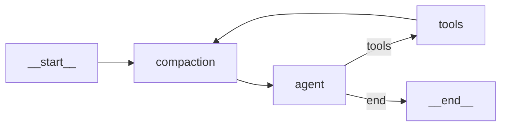

# Memoria a corto plazo: compactación en cascada en LangGraph

> **Síntesis.** La memoria a corto plazo de un agente no se resuelve borrando mensajes viejos: se resuelve **destilando** el historial antes de que el contexto se sature. La estrategia operativa es una **compactación en cascada** con dos etapas en orden de costo: primero una **microcompactación** gratuita que recorta resultados de herramientas antiguos, y solo cuando se cruza un umbral crítico (≈80% de la ventana) se invoca un **LLM secundario** que produce notas estructuradas. En LangGraph esto se materializa como un nodo —`compaction_node`— colocado **antes** del agente principal, de modo que el agente nunca tenga que gestionar su propia memoria. El resultado es un agente que mantiene coherencia operativa indefinidamente sin que su factura ni su latencia crezcan sin control.

## Introducción

Las dos primeras sesiones del módulo dejaron asentado el marco: la memoria de un agente es una **arquitectura externa al modelo**, la ventana de contexto es finita y, además, **degradable** —el Context Rot aparece mucho antes de chocar con el techo de tokens—. La conclusión natural es que necesitamos un mecanismo que decida, turno a turno, qué se conserva intacto, qué se comprime y qué se reemplaza por un resumen.

Esta sesión es la primera implementación práctica de esa idea. Bajamos del marco conceptual al código TypeScript de un agente real construido en LangGraph y vamos a introducir un nuevo nodo en el grafo: `compaction_node`. Ese nodo es la **memoria a corto plazo** del agente. Su trabajo es invisible para el resto del sistema —el agente principal no se entera de que la memoria existe— y aplica una estrategia inspirada en cómo los asistentes tipo Claude Code o Cursor gestionan sus propios contextos largos: una **cascada** de compactaciones de coste creciente, donde solo se paga el siguiente nivel cuando el anterior ya no alcanza.

## Objetivos de aprendizaje

1. Explicar por qué **destilar el historial** es operativamente superior a borrarlo, en términos de coherencia de la sesión, costo y latencia.
2. Diferenciar las dos estrategias que componen una **compactación en cascada** —microcompactación gratuita y compactación avanzada con LLM— y reconocer cuándo procede cada una.
3. Diseñar la **topología de un grafo en LangGraph** ubicando el nodo de compactación en el lugar correcto para que el agente principal no cargue con la responsabilidad de gestionar su memoria.
4. Implementar en **TypeScript** la lógica de compactación: umbral, microcompact, llamada al LLM secundario, reemplazo de mensajes con `RemoveMessage` y un **circuit breaker** para que un fallo no rompa el agente.
5. Validar el funcionamiento del nodo bajando el umbral en pruebas, leyendo los logs de activación y verificando que el resumen estructurado se inyecta correctamente en el contexto del agente principal.

## Marco conceptual

### El problema que estamos resolviendo

En el agente que veníamos construyendo, el historial se gestionaba por dos caminos descoordinados. Al iniciar un turno, se cargaban los últimos N mensajes desde la base de datos; dentro del turno, el reducer de mensajes era un **append puro**: cada ciclo `agent → tools → agent` acumulaba un `AIMessage` con los `tool_calls` más el `ToolMessage` con el resultado. Con un tope de seis iteraciones por turno y herramientas como `bash` o `gcal_list_events` que devuelven respuestas grandes, el array crecía rápido y de forma desproporcionada respecto al avance real de la conversación.

Eso es exactamente el patrón que produce **Context Rot**: el modelo recibía cada vez más tokens, muchos de ellos resultados de herramientas que ya había leído, razonado y resumido en su propia respuesta. No solo subía el costo y la latencia; la atención efectiva sobre las instrucciones nuevas del usuario se diluía entre kilobytes de salida de herramientas ya consumidas.

La tentación ingenua es resolverlo borrando: tirar los mensajes más antiguos cuando el historial supere cierto tamaño. Pero borrar **pierde información** que el agente puede necesitar más adelante —decisiones tomadas, datos extraídos por herramientas, restricciones declaradas por el usuario—. La alternativa es **destilar**: reemplazar el bloque viejo por una versión comprimida que conserve lo esencial.

### La analogía operativa: tomar notas en una reunión larga

La forma intuitiva de pensar la compactación en cascada es imaginarse en una reunión de tres horas. Nadie transcribe cada palabra; se toman **notas de los puntos clave**. Y esas notas no se redactan en bloque al final: durante la reunión se hacen pequeños recortes —ignorar comentarios irrelevantes, no apuntar el `print` de depuración que alguien proyectó— y solo cuando la libreta empieza a llenarse de verdad se hace una pausa para reescribir un resumen estructurado de lo discutido hasta ese momento.

Esa secuencia —limpieza barata constante, resumen profundo solo cuando es necesario— es la **cascada**. Los dos niveles tienen costos muy diferentes: el primero es prácticamente gratis, el segundo implica detenerse a pensar. La regla operativa es nunca pagar el nivel caro mientras el barato sea suficiente.

### Microcompactación: la primera línea de defensa

La microcompactación es la etapa gratuita: no llama a ningún LLM extra, solo manipula el array de mensajes con reglas locales. En nuestro caso concreto, se enfoca en lo que más crece sin pedir permiso: los **resultados de herramientas**.

La regla es simple: conserva intactos los **últimos cinco** resultados de tool y reemplaza los anteriores por un placeholder corto del estilo `[tool result cleared]`. La intuición es que los resultados de tool más recientes son los que el modelo todavía puede necesitar revisar para razonar sobre el turno actual; los más viejos ya fueron consumidos por el propio modelo en sus respuestas posteriores y mantenerlos enteros es ruido. El placeholder ocupa pocos tokens pero deja constancia de que ahí hubo un resultado de herramienta, por si más adelante el agente necesita reconstruir la secuencia.

Es importante que esta operación sea **idempotente**: si el mensaje ya está marcado como `[tool result cleared]`, no se vuelve a tocar. Y debe ser **reversible** en lo arquitectural: para reemplazar un mensaje viejo por su versión limpiada, el nuevo mensaje viaja con el **mismo `id`** que el original, de modo que el reducer del estado lo trate como una sustitución y no como un mensaje nuevo añadido al final.

### Compactación avanzada: cuando hay que pagar el LLM

La microcompactación sola no alcanza para conversaciones realmente largas: el historial de mensajes humanos, respuestas del asistente y `SystemMessages` sigue creciendo aunque los tool results estén recortados. Para esos casos se activa la segunda etapa, que **sí** llama a un LLM —típicamente uno barato, en nuestro caso uno servido por OpenRouter con sufijo `:free`— cuya única tarea es producir un resumen estructurado del historial.

El disparador es un **umbral**: cuando el conteo aproximado de tokens del estado proyectado (es decir, ya con los microcompacts aplicados) cruza un porcentaje de la ventana de contexto, se activa la etapa 2. El umbral típico está en torno al **80%**. Por debajo, no se paga el costo del LLM secundario; por encima, se asume que el riesgo de saturación es real y vale la pena el gasto.

La elección del 80% no es arbitraria. Dejar 20% de margen es necesario porque **el propio proceso de compactación tiene que caber en la ventana**: el prompt enviado al LLM secundario contiene el historial que se está resumiendo, y la respuesta —el resumen estructurado— se inyectará después en el estado del agente principal. Si se dispara la compactación al 95%, no queda espacio para que el resumen viaje cómodamente junto al system prompt y el último turno del usuario.

### El prompt del compactador: notas estructuradas, no prosa libre

Cuando se invoca al LLM secundario, **no** se le pide que produzca un resumen narrativo. Se le pide que extraiga **notas estructuradas** con secciones obligatorias. Pedir prosa libre produce resúmenes blandos, pegados al tono original del modelo principal, donde la información concreta —ids, fechas, paths, valores extraídos por tools— se diluye en frases de conexión inútiles. Pedir secciones obligatorias fuerza al compactador a extraer datos discretos.

En nuestra implementación el prompt impone nueve secciones, en este orden: objetivo declarado del usuario, decisiones tomadas, datos extraídos de tool calls, acciones ejecutadas exitosamente, acciones rechazadas o fallidas, estado actual de las integraciones, preguntas pendientes del agente al usuario, restricciones o preferencias declaradas, y próximo paso lógico. Esa lista refleja exactamente lo que un agente operativo necesita recordar para no romper la continuidad si el detalle literal del historial desaparece.

Dos reglas extra del prompt importan: «no inventes información que no esté en el historial» —cualquier modelo, libre de presión, alucina detalles plausibles cuando se le pide resumir— y «si una sección no tiene contenido, escribe `ninguno`» —para no forzar al compactador a inventar contenido en secciones vacías—. Una defensa adicional al recibir la respuesta del compactador es **eliminar bloques `<analysis>`**: algunos modelos abiertos los emiten para razonar antes de responder, y si se cuelan en el contexto del agente principal le ensucian el prompt.

### Arquitectura de nodos en LangGraph: dónde colocar el compactador

LangGraph organiza el flujo de un agente como un **grafo dirigido** de nodos y aristas. En nuestro punto de partida había dos nodos principales —`agent` (donde se invoca al modelo) y `tools` (donde se ejecutan las herramientas)— con un ciclo entre ellos hasta que el modelo decidiera terminar el turno.

La decisión de diseño crucial al introducir la memoria a corto plazo es **dónde se coloca el nuevo nodo**. La opción tentadora —y equivocada— es darle al agente la responsabilidad de gestionar su propia memoria: incluir instrucciones en el system prompt del estilo «si el historial es muy largo, resúmelo». Esto carga cognitivamente al modelo con una tarea que no es la suya: tomar decisiones de meta-gestión sobre su propio contexto mientras intenta responder al usuario.

La opción correcta es **interponer un nodo dedicado antes del agente**:



Cada turno comienza pasando por `compaction`, que aplica microcompact y, si corresponde, compactación con LLM. Luego entra al ciclo `agent ↔ tools`, pero ojo con la arista crítica: **`tools → compaction`**, no `tools → agent`. Cada resultado de herramienta pasa por el compactador antes de volver al modelo principal. Esto es lo que evita que el agente acumule kilobytes de salida de herramientas dentro del propio turno.

Desde la perspectiva del agente principal, esta arquitectura es invisible: él no sabe que existe un compactador. Recibe un estado y responde. La memoria a corto plazo es una propiedad del sistema, no del agente.

### Mecánica de reemplazo: por qué el reducer importa

LangGraph permite definir un **reducer** para cada campo del estado. El reducer estándar para `messages` viene en el propio framework (`messagesStateReducer`) y tiene tres comportamientos clave:

- Si llega un mensaje **sin `id`** existente en el estado, lo añade al final.
- Si llega un mensaje con un `id` que **ya existe**, **reemplaza** la entrada original.
- Si llega un `RemoveMessage(id)`, **elimina** la entrada con ese id.

Sin este reducer, devolver un array más corto desde `compaction_node` simplemente lo concatenaría al final, no reduciría nada. Por eso el cambio de reducer es la **pieza arquitectural sin la cual el resto no funciona**. Lo que se gana al cablearlo es que el nodo de compactación puede emitir tres tipos de actualizaciones:

1. **Microcompact**: emite `ToolMessage` con el mismo `id` que el original y contenido `[tool result cleared]` → reducer reemplaza.
2. **LLM compaction**: emite un `RemoveMessage(id)` por cada mensaje del head viejo + un `SystemMessage` nuevo con el resumen → reducer elimina los viejos y añade el nuevo.
3. **Sin cambios**: si nada hay que tocar, devuelve `{}` y el estado pasa intacto.

Como precondición para todo esto, **cada mensaje del estado debe tener un `id`**. Los mensajes que devuelve `@langchain/core` ya lo traen; los `SystemMessage`/`HumanMessage`/`AIMessage` que el código construye manualmente al cargar historial desde la DB hay que crearlos asignándoles un `randomUUID()`. Si por alguna razón un mensaje viejo viene sin id, el nodo lo omite del cleanup en vez de fallar.

### Circuit breaker: que un fallo no rompa al agente

El LLM secundario puede fallar por cualquier motivo —rate limit del proveedor, output malformado, timeout, slug rotado—. Hay que decidir qué pasa entonces. La opción peligrosa es **propagar el error**: cualquier hipo del compactador romperíael agente principal, aunque la conversación pudiera continuar perfectamente con el historial sin compactar.

La opción correcta es un **circuit breaker**: el estado guarda un contador `compactionFailures`. Cada vez que la etapa 2 falla o devuelve un resumen vacío tras la limpieza, el contador se incrementa. Cada vez que tiene éxito, se resetea a cero. Si al entrar al nodo el contador llega a **3**, el nodo hace **passthrough** —devuelve `{}` sin tocar el estado— y el agente sigue funcionando con el contexto completo, degradado pero no roto.

Esta es una decisión clásica de diseño: la **memoria es una optimización**, no un requisito de corrección. Cuando la optimización falla repetidamente, prefiero un agente que responde más lento o más caro a un agente que no responde.

### Implementación en TypeScript con Cursor

El editor Cursor cumple aquí un rol concreto: planificar la modificación del grafo, identificar los puntos de inserción y generar el código TypeScript con tipos correctos. La intervención principal ocurre en tres archivos:

- **`packages/agent/src/state.ts`** (nuevo): extrae el `GraphState` con el `messagesStateReducer` oficial y un nuevo campo `compactionFailures` con reducer de reemplazo. Antes el estado se definía inline en `graph.ts`; sacarlo a su propio módulo es necesario porque ahora `compaction_node` también lo importa.
- **`packages/agent/src/nodes/compaction_node.ts`** (nuevo): contiene toda la lógica que vimos arriba —microcompact, evaluación de threshold, llamada al LLM secundario, circuit breaker, logging—.
- **`packages/agent/src/graph.ts`** (modificado): registra el nuevo nodo (`addNode("compaction", compactionNode)`), recablea las aristas (`__start__ → compaction`, `compaction → agent`, `tools → compaction`) y asegura que los `SystemMessage`/`HumanMessage`/`AIMessage` construidos al hidratar desde la DB llevan un `randomUUID()`.

Las constantes clave quedan al inicio del nodo, fáciles de auditar y modificar:

```ts
const CONTEXT_WINDOW = 64_000;
const COMPACTION_THRESHOLD = 0.8;
const TOOL_RESULTS_TO_PRESERVE = 5;
const TAIL_TURNS_TO_KEEP = TOOL_RESULTS_TO_PRESERVE + 2;
const MAX_CONSECUTIVE_FAILURES = 3;
```

La estimación de tokens es deliberadamente barata: `chars / 4`. Tirar de un tokenizer real (`gpt-tokenizer`, `tiktoken`) habría añadido un megabyte y medio de dependencia para ganar una precisión que el buffer del 20% absorbe sin problema. Es el tipo de decisión donde la heurística simple es la correcta hasta que se demuestre lo contrario.

### Validación: bajar el umbral y leer los logs

El antipatrón al validar un sistema de compactación es esperar a que «pase solo» en una conversación real. Las conversaciones reales son lentas, irreproducibles y dejan poco rastro. La estrategia operativa es la contraria: forzar la activación.

El método es bajar temporalmente la constante `COMPACTION_THRESHOLD` a un valor absurdamente pequeño —por ejemplo **0.01 (1%)**— para que la etapa 2 se dispare en el primer turno. Eso te deja ver en los logs si:

- El nodo se está invocando (logs `before` / `after` con `stage` y conteo de mensajes).
- El microcompact está emitiendo reemplazos en los mensajes correctos.
- El LLM secundario está siendo llamado, no falla, y su respuesta atraviesa el `stripAnalysisBlocks`.
- El `RemoveMessage` está purgando los mensajes esperados.
- El nuevo `SystemMessage` con el resumen está apareciendo en el estado posterior.

Un detalle pragmático: el nodo escribe un log estructurado a un archivo (`compaction.log`) con dos entradas por invocación, `before` y `after`, listando los mensajes con tipo, id corto, conteo de caracteres y una vista previa truncada. No es elegante, pero leer ese archivo durante el desarrollo vale por mucha telemetría sofisticada. El log es **diagnóstico**: si su escritura falla, el agente no se cae, solo emite un `warn`.

Una vez confirmado todo eso, se restaura el umbral a `0.8` para producción. La validación end-to-end pendiente —forzar una conversación larga real y verificar que la persistencia con el checkpointer Postgres no «deshace» la compactación al rehidratar el thread— queda como prueba manual antes de considerar la integración cerrada.

### Trade-offs explícitos

Vale la pena hacer explícitos los compromisos que esta arquitectura impone:

- **La etapa 2 cuesta dinero y tiempo**. Cada activación es una llamada extra al LLM. Configurar mal el umbral —demasiado bajo— infla la factura. Por eso el 80% es un piso razonable y el monitoreo de cuántas veces se dispara por sesión es una métrica que vale la pena observar.
- **El resumen pierde matices**. Por bueno que sea el compactador, no es el agente original; algunos detalles se perderán. La pregunta de diseño es si esos detalles importaban más que el espacio que ocupaban, y la respuesta honesta es que en la mayoría de los casos no.
- **El compactador puede equivocarse**. El circuit breaker mitiga la falla dura, pero un resumen mediocre que el modelo principal acepta como verdadero puede arrastrar errores. La defensa estructural es el prompt de notas estructuradas: pedir secciones concretas con datos discretos en vez de prosa libre reduce el espacio de alucinación.

Ninguno de estos trade-offs invalida la arquitectura; lo que hacen es marcar el horizonte de mejoras posibles —mejores heurísticas de umbral, prompt del compactador iterado contra fallos reales, métrica de compresión efectiva en los logs—.

## Síntesis

La memoria a corto plazo de un agente no es magia ni un detalle de configuración: es un **nodo dedicado** en el grafo que aplica una **cascada de compactaciones** en orden de costo creciente. La microcompactación recorta tool results viejos por casi nada; la compactación avanzada con LLM se activa solo cuando el umbral lo justifica y produce **notas estructuradas** —no prosa libre— que reemplazan el head del historial. Toda la mecánica descansa sobre dos piezas finas: el `messagesStateReducer` oficial de LangGraph, que habilita el reemplazo y la eliminación de mensajes por id, y un **circuit breaker** que protege al agente principal cuando la optimización falla. El resultado es un agente que mantiene su contexto curado turno a turno sin saber siquiera que existe una memoria a corto plazo gestionándolo desde fuera —exactamente como el principio de Context Engineering predicaba en la sesión anterior, ahora aterrizado en código.

## Preguntas de repaso

1. ¿Por qué decimos que **destilar** el historial es operativamente superior a **borrarlo**? Da al menos dos consecuencias prácticas concretas de cada estrategia.
2. Describe las dos etapas de la **compactación en cascada**. ¿Qué dispara el paso de la primera a la segunda, y por qué el umbral típico se fija en torno al 80% y no al 95%?
3. ¿Qué problema arquitectural se evita al colocar el `compaction_node` **antes** del agente principal en lugar de pedirle al propio agente que gestione su memoria? ¿Qué relación tiene esto con el concepto de sobrecarga cognitiva del modelo?
4. ¿Qué papel cumple el `messagesStateReducer` en LangGraph y por qué sin él no es posible implementar compactación con `RemoveMessage`? Explica los tres comportamientos del reducer ante un mensaje entrante.
5. Explica por qué el prompt del LLM secundario pide **secciones obligatorias** en vez de un resumen narrativo libre. ¿Qué tipo de errores estructurales evita esa decisión?
6. ¿Qué es y para qué sirve el **circuit breaker** del nodo de compactación? ¿Qué pasa con el agente cuando se «abre» y por qué esa degradación es preferible a propagar el fallo?
7. Si quisieras forzar la activación inmediata de la etapa 2 para validar el sistema, ¿qué constante modificarías y a qué valor? Explica qué deberías ver en los logs para considerar la prueba exitosa.

## Recursos

- [Rama `agent-memory` del proyecto 10x-builders-agent](https://github.com/lab10-org/10x-builders-agent/tree/agent-memory) — implementación de referencia del `compaction_node`.
- [LangGraph.js — Memory management](https://langchain-ai.github.io/langgraphjs/concepts/memory/) — documentación oficial de gestión de memoria en LangGraph.
- [LangGraph.js — `messagesStateReducer`](https://langchain-ai.github.io/langgraphjs/concepts/low_level/#reducers) — referencia del reducer oficial usado para reemplazo y eliminación de mensajes por id.
- [Anthropic — Effective context engineering](https://www.anthropic.com/news/context-engineering-for-agents) — buenas prácticas que inspiran la estrategia de cascada.
- Conexión interna: [Memoria en Agentes de IA: Fundamentos](./01-memoria-agentes-ia-fundamentos.md) — base conceptual de memoria a corto/largo plazo.
- Conexión interna: [Context Rot y Context Engineering](./02-context-rot-and-context-engineering.md) — por qué curar el contexto importa más que ampliarlo.
