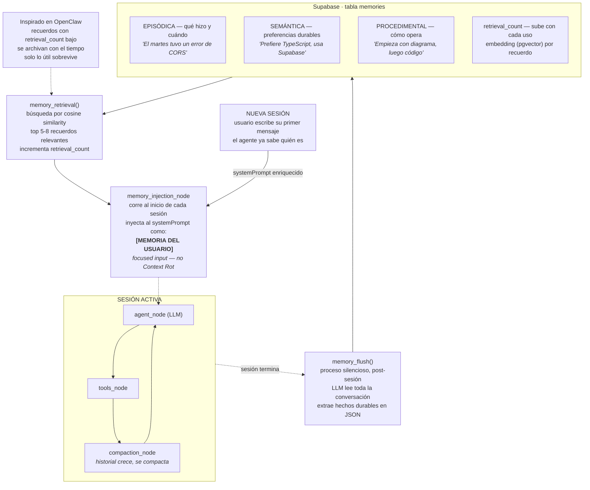

# Fundamentos de Memoria a Largo Plazo en Agentes de IA

> **Síntesis.** Cada sesión de chat nace como una pizarra en blanco: el agente no sabe quién eres, qué te gusta ni qué hicieron juntos la última vez. La memoria a largo plazo es el sistema que rompe esa amnesia. No consiste en guardar la conversación entera, sino en **destilar hechos durables** al cerrar una sesión —el **memory flush**—, clasificarlos en tres tipos (episódica, semántica, procedimental), almacenarlos en una tabla persistente en Supabase y recuperarlos de forma enfocada al iniciar la siguiente sesión —el **memory injection**—. Una métrica simple, el **retrieval count**, crea una jerarquía natural: los recuerdos que el agente consulta a menudo ganan prioridad y sobreviven a la saturación; los que nunca se usan se archivan. El resultado es un agente que aprende del usuario a lo largo del tiempo sin pagar el costo de recordarlo todo.

## Introducción

Las tres sesiones anteriores del módulo construyeron el andamiaje. La primera estableció que la memoria de un agente es una **arquitectura externa al modelo** y separó las dos capas —corto y largo plazo—. La segunda explicó por qué la ventana de contexto no solo es finita sino **degradable**: el Context Rot diluye la atención del modelo mucho antes de chocar con el techo de tokens. La tercera bajó al código la memoria a **corto** plazo: el `compaction_node` que destila el historial dentro de una sesión activa.

Esta sesión cierra el otro extremo. Si la compactación resuelve qué hacer con el contexto **dentro** de una sesión, la memoria a largo plazo resuelve qué sobrevive **entre** sesiones. El problema concreto es la **amnesia**: por muy bien curado que esté el contexto de hoy, mañana —en una sesión nueva, en otro canal, tras un reinicio del proceso— ese contexto ya no existe. El usuario tiene que volver a explicar quién es, qué prefiere y en qué quedaron.

Para pensarlo usamos el framework mental del **baúl de los recuerdos**: un espacio persistente —técnicamente, una tabla en Supabase— donde el agente deposita notas sobre lo que considera importante de sus conversaciones contigo. No transcribe cada palabra; extrae los **hechos relevantes** y los guarda de forma organizada, para que la próxima vez revise primero su baúl antes de hablar. Esta clase es teórica y conceptual: al terminar comprenderás la arquitectura completa —flush, almacenamiento, retrieval, injection— y estarás listo para el siguiente paso práctico, que es diseñar las columnas exactas de esa tabla.

## Objetivos de aprendizaje

1. **Explicar** la necesidad de una memoria a largo plazo para evitar la pérdida de contexto entre sesiones, distinguiéndola con precisión de la memoria a corto plazo.
2. **Clasificar** la información del usuario en memoria episódica, semántica y procedimental para decidir cómo estructurar su almacenamiento.
3. **Describir** el mecanismo de *memory flush* —cuándo se dispara, qué hace en segundo plano— y el uso del *retrieval count* para priorizar recuerdos.
4. **Integrar** un nodo de *memory injection* en la arquitectura del agente para inyectar contexto histórico y preferencias por defecto antes de la ejecución.
5. **Diseñar** la estructura y las columnas de una tabla que soporte el sistema de retención y consulta de memorias, apoyándose en `pgvector` para la búsqueda semántica.

## Marco conceptual

### El problema: la amnesia entre sesiones

Un modelo de lenguaje no recuerda nada por sí mismo —esa idea ya quedó asentada en la sesión 1—. Lo que añade esta clase es una observación más fina: **la memoria a corto plazo, por bien resuelta que esté, no basta**. El `compaction_node` que construimos mantiene coherente el contexto de una sesión activa, pero esa memoria es **volátil**: muere cuando la sesión se cierra. Cada conversación nueva arranca sin conocimiento previo del usuario.

El síntoma es familiar para cualquiera que use un chatbot a diario: le explicas tus preferencias, trabajas con él una hora, cierras la pestaña, y al día siguiente vuelve a tratarte como un desconocido. No aprende. No acumula. Cada interacción es una isla. La memoria a largo plazo es la decisión arquitectural de construir puentes entre esas islas: un sistema **persistente y selectivo** que sobrevive al cierre de la sesión y conserva únicamente los hechos destilados que merecen recordarse.

### La analogía del baúl de los recuerdos

Imagina que el agente tiene un baúl —que en términos técnicos será nuestra base de datos en Supabase— donde guarda notas sobre lo que considera importante de sus conversaciones contigo. La clave de la analogía está en la palabra **notas**: el agente no fotografía la conversación entera ni la archiva literal. Eso sería caro, ruidoso e inútil —volveríamos al problema de Context Rot, ahora trasladado a la base de datos—.

En lugar de eso, extrae únicamente los **hechos relevantes** y los deposita en el baúl de forma organizada. Cuando vuelve a hablar contigo en el futuro, lo primero que hace es revisar su baúl para saber **quién eres, qué te gusta y qué hicieron juntos la última vez**. El baúl es selectivo por diseño: su valor no está en cuánto guarda, sino en que lo que guarda sea durable y recuperable.

### El memory flush: barrer el historial al cerrar

El **memory flush** es el mecanismo que llena el baúl. Su rasgo distintivo es que **no ocurre constantemente**: es un proceso estratégico que se dispara al **finalizar** una sesión —porque pasó un tiempo de inactividad, porque el usuario canceló la interacción, o porque la conversación se da por cerrada—.

Cuando se dispara, el sistema trabaja **en segundo plano** y de forma silenciosa: un LLM lee toda la conversación reciente, **barre** el historial a corto plazo y extrae los hechos que merecen recordarse a futuro. Su salida no es prosa libre, sino **hechos durables estructurados** —típicamente en JSON— listos para almacenarse en la tabla de memorias. Esto conecta directamente con una lección de la sesión 3: pedir estructura, no narrativa, reduce el espacio de alucinación y produce datos discretos en vez de resúmenes blandos.

Conviene fijar la diferencia con la compactación a corto plazo, porque se parecen pero no son lo mismo:

| | Compactación (corto plazo) | Memory flush (largo plazo) |
|---|---|---|
| **Cuándo** | Durante la sesión, al cruzar un umbral de tokens | Al **cerrar** la sesión (inactividad / cancelación) |
| **Dónde vive el resultado** | En el estado de la sesión (contexto) | En una tabla persistente (Supabase) |
| **Objetivo** | Que el contexto no sature ahora | Que el conocimiento sobreviva a la sesión |
| **Alcance** | El hilo actual | Toda la relación con el usuario en el tiempo |

### Los tres tipos de memoria

Todo lo que el flush extrae se clasifica en tres tipos. Esta taxonomía no es decorativa: determina cómo se estructura el almacenamiento y cómo se recupera después.

- **Memoria episódica** — Registra **eventos específicos con su estampa de tiempo**: qué hizo el usuario y cuándo. Es el "diario" del agente.
  *Ejemplo:* «El martes el usuario tuvo un error de CORS» · «Ayer pidió un script en Python».

- **Memoria semántica** — Almacena **hechos y preferencias generales y atemporales** del usuario. Es el "perfil" del agente sobre ti.
  *Ejemplo:* «Prefiere TypeScript y usa Supabase» · «Le gustan las respuestas cortas y directas».

- **Memoria procedimental** — Guarda el **cómo**: instrucciones y metodologías sobre la forma en que el usuario prefiere que se realicen ciertas tareas.
  *Ejemplo:* «Empieza con un diagrama, luego el código» · «Antes de hacer commit, organiza por tipo».

La distinción episódica/semántica es sobre todo una cuestión de **temporalidad**: un evento fechado es episódico; cuando ese evento se repite hasta volverse un patrón atemporal, asciende a semántico. La procedimental es ortogonal: no describe quién eres ni qué pasó, sino **cómo operar contigo**.

### El retrieval count: jerarquía por uso

No todos los recuerdos valen lo mismo, y el agente no puede inyectar el baúl entero en cada sesión —eso reintroduciría exactamente el Context Rot que intentamos evitar—. Necesitamos un criterio para decidir **qué recuerdos suben primero**. Ese criterio es el **retrieval count** (contador de recuperación).

Es un número asociado a cada recuerdo que **se incrementa cada vez que el agente consulta y utiliza esa información**. Funciona como un sistema de ponderación: durante la inyección de memoria, el sistema **prioriza los recuerdos con contador más alto**. Esto crea una jerarquía natural y autorregulada —los recuerdos consultados con frecuencia ganan relevancia, y la información más útil sobrevive a la saturación de datos—.

El corolario, inspirado en sistemas como **OpenClaw**, es la **decadencia por desuso**: los recuerdos con retrieval count bajo se archivan con el tiempo. El baúl no crece indefinidamente; se poda solo. **Solo lo útil sobrevive.** Es la misma filosofía que vimos en corto plazo —destilar, no acumular— aplicada ahora a la escala de la relación completa con el usuario.

### El memory injection: enriquecer el contexto antes de ejecutar

Si el flush **llena** el baúl al cerrar, el **memory injection** lo **consulta** al abrir. Es un nodo que corre **al inicio de cada sesión**, antes de que el agente procese el primer mensaje del usuario. Su trabajo es recuperar los recuerdos relevantes e inyectarlos en el `systemPrompt` bajo una sección del estilo `[MEMORIA DEL USUARIO]`, de modo que el agente arranque sabiendo quién eres.

La recuperación no es un volcado completo: es una **búsqueda enfocada**. Aquí entra `pgvector`. Cada recuerdo se almacena junto a su **embedding** —su representación vectorial—; el mensaje entrante del usuario también se vectoriza, y se buscan los recuerdos más cercanos por **similitud de coseno**, tomando un **top reducido** (típicamente 5–8). De ese conjunto, retrieval count desempata: a igualdad de relevancia semántica, gana el más usado. Y cada recuerdo recuperado **incrementa su retrieval count**, cerrando el ciclo de aprendizaje.

El énfasis en *enfocado* es deliberado y conecta con la sesión 2: inyectar solo los 5–8 recuerdos pertinentes —en vez del baúl entero— es lo que mantiene el `systemPrompt` ágil y evita el Context Rot. La memoria a largo plazo bien diseñada **no** infla el contexto: lo enriquece con precisión quirúrgica.

### Arquitectura completa del agente con memoria

Juntando las piezas, el agente requiere dos modificaciones clave respecto al grafo que veníamos construyendo. Primero, un **nodo de memory injection previo a la ejecución**, que inyecta el contexto histórico (incluidas preferencias por defecto) antes de procesar el nuevo mensaje. Segundo, una **herramienta activa** para que el agente pueda consultar su memoria a demanda durante la conversación, no solo al inicio.

El diagrama siguiente muestra el ciclo completo —extracción post-sesión, almacenamiento en Supabase, recuperación enfocada— y cómo se enlaza con la sesión activa y el `compaction_node` de la sesión anterior:

Leído como ciclo: la **sesión activa** acumula historial que el `compaction_node` mantiene a raya (corto plazo). Cuando la **sesión termina**, el `memory_flush()` barre la conversación y deposita hechos clasificados en la tabla `memories` de Supabase. Al llegar una **nueva sesión**, `memory_retrieval()` busca por similitud de coseno los 5–8 recuerdos más pertinentes —incrementando su `retrieval_count`— y el `memory_injection_node` los inyecta en el `systemPrompt`. El agente arranca enriquecido, **ya sabe quién eres**, y el ciclo vuelve a empezar.

### Diseño de la tabla de memorias

El conocimiento teórico anterior sienta las bases del próximo paso práctico: diseñar las columnas exactas de la tabla en Supabase. Conceptualmente, una memoria necesita responder cinco preguntas, y cada una sugiere una columna:

- **¿De quién es?** → un identificador de usuario (`user_id`), para que el baúl de cada persona esté aislado.
- **¿Qué tipo de recuerdo es?** → un enum `episodic | semantic | procedural`, que gobierna cómo se inyecta y prioriza.
- **¿Qué dice?** → el contenido del hecho destilado (`content`), idealmente con la estructura JSON que produjo el flush.
- **¿Cómo se busca semánticamente?** → el `embedding` vectorial (`vector`, vía `pgvector`), sobre el que opera la similitud de coseno.
- **¿Qué tan útil ha sido?** → el `retrieval_count`, más una marca de tiempo (`created_at` / `last_accessed_at`) para soportar tanto la memoria episódica como la política de archivado por desuso.

El reto de diseño completo —tipos exactos, índices vectoriales, políticas RLS por usuario, función de matching— se aborda en la siguiente sesión práctica. Por ahora basta con entender **por qué** existe cada columna: la estructura de la tabla es el reflejo directo del ciclo flush → store → retrieve → inject.

## Síntesis

La memoria a largo plazo es la cura de la amnesia entre sesiones, y su mecánica es un ciclo de cuatro tiempos. El **memory flush** se dispara al cerrar la sesión y destila la conversación en hechos durables clasificados como **episódicos** (eventos fechados), **semánticos** (preferencias atemporales) o **procedimentales** (cómo operar). Esos hechos viven en una tabla de Supabase con su **embedding** (`pgvector`) y un **retrieval count** que crea jerarquía por uso. Al abrir una sesión nueva, el **memory retrieval** busca por similitud de coseno los 5–8 recuerdos más pertinentes —subiendo su contador— y el **memory injection node** los inyecta en el `systemPrompt` antes de que el agente procese nada. La pieza fina es la **selectividad en ambos extremos**: el flush guarda solo lo durable y el injection recupera solo lo pertinente, de modo que el baúl crezca con sentido y el contexto nunca se sature —el mismo principio de Context Engineering de la sesión 2, ahora extendido más allá de los límites de una sola sesión—.

## Preguntas de repaso

1. ¿Por qué la memoria a corto plazo, aunque esté perfectamente resuelta con el `compaction_node`, **no basta** para que un agente "aprenda" del usuario? Define amnesia entre sesiones con tus palabras.
2. El *memory flush* y la compactación a corto plazo se parecen pero no son lo mismo. Da al menos tres diferencias concretas (cuándo se dispara, dónde vive el resultado, qué alcance tiene).
3. Clasifica estas tres notas en episódica, semántica o procedimental y justifica: (a) «El usuario prefiere respuestas cortas»; (b) «El jueves desplegó la rama `agent-memory`»; (c) «Antes de codear, pide siempre un diagrama».
4. ¿Qué problema concreto resuelve el *retrieval count* durante la inyección de memoria? Explica cómo crea una jerarquía y cómo se conecta con la idea de archivar recuerdos poco usados ("solo lo útil sobrevive").
5. ¿Por qué el *memory injection* recupera solo un **top 5–8** de recuerdos en vez de inyectar el baúl completo? Relaciona tu respuesta con el Context Rot de la sesión 2.
6. Describe el rol de `pgvector` y la **similitud de coseno** en el retrieval. ¿Qué se vectoriza y contra qué se compara?
7. Enumera las columnas mínimas que necesitaría la tabla `memories` y explica qué pregunta del ciclo responde cada una.

## Recursos

- [Supabase — AI & Vectors (pgvector)](https://supabase.com/docs/guides/ai) — documentación oficial de integración de IA y búsqueda vectorial con `pgvector`.
- [Supabase — Vector columns & similarity search](https://supabase.com/docs/guides/ai/vector-columns) — cómo definir columnas vectoriales y funciones de matching por coseno.
- [Generative Agents: Interactive Simulacra of Human Behavior (Stanford)](https://arxiv.org/abs/2304.03442) — arquitectura de memoria (memory stream, recencia, importancia, relevancia) que inspira el retrieval count.
- [OpenClaw — política de archivado de recuerdos por desuso](https://github.com/openclaw) — referencia conceptual de la decadencia por bajo retrieval count.
- Conexión interna: [Memoria en Agentes de IA: Fundamentos](./01-ai-agent-memory-fundamentals.md) — panorámica de corto vs. largo plazo y los tres tipos de memoria.
- Conexión interna: [Context Rot y Context Engineering](./02-context-rot-and-context-engineering.md) — por qué la inyección debe ser enfocada y no un volcado completo.
- Conexión interna: [Memoria a corto plazo: compactación en cascada en LangGraph](./03-short-term-memory-cascading-compaction.md) — el `compaction_node` que gobierna la memoria dentro de la sesión activa.

## Notas personales

<!-- Observaciones propias, conexiones con otros temas, ideas. -->

