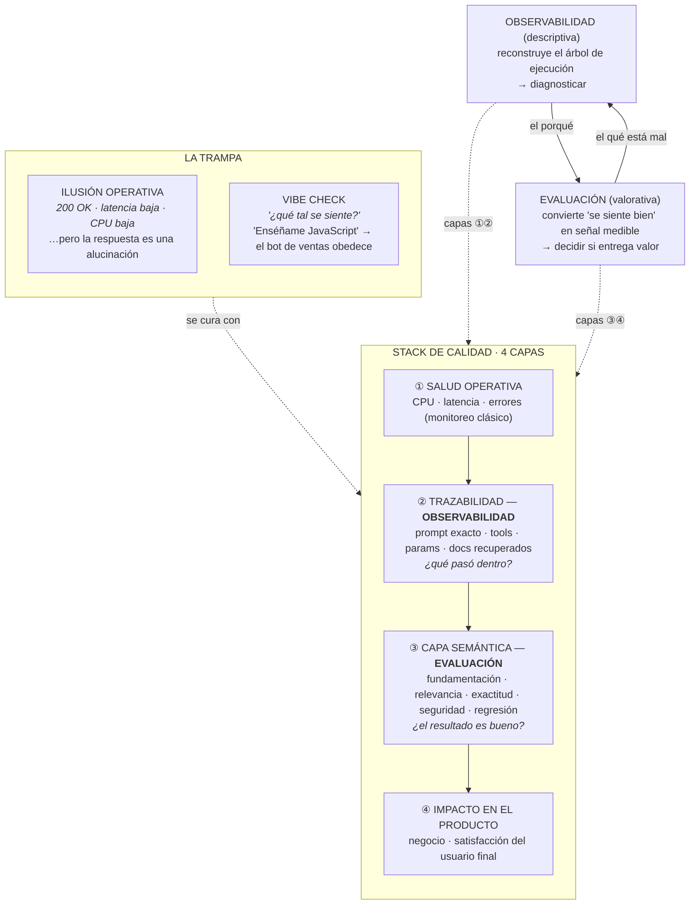

# Observabilidad y Evaluación en Sistemas de Inteligencia Artificial

> **Síntesis.** En el software clásico bastaba con que el sistema estuviera encendido, consumiera poca CPU y respondiera rápido: si devolvía un `200 OK`, funcionaba. Los sistemas basados en LLMs rompen esa equivalencia. Son **probabilísticos**: pueden responder con latencia perfecta y sin lanzar una sola excepción mientras entregan una alucinación, un insulto o una respuesta fuera de su propósito. A eso lo llamamos **ilusión operativa** —métricas de infraestructura impecables que ocultan fallas semánticas— y su versión casera es el **vibe check**: validar un agente haciéndole un par de preguntas informales. La cura tiene dos piezas que trabajan juntas: la **observabilidad**, que reconstruye *qué pasó* dentro de la caja negra (prompts, tools, documentos recuperados), y la **evaluación**, que juzga *si el resultado es bueno* según dimensiones medibles —fundamentación, exactitud y relevancia, seguridad, regresión—. Ambas se organizan en un **stack de calidad de 4 capas**: salud operativa, trazabilidad, capa semántica e impacto en el producto. Esta clase es el marco mental; las próximas lo instrumentan en herramientas reales como LangSmith y Ragas.

## Introducción

Hasta ahora el curso construyó agentes cada vez más capaces: con herramientas, con estado, con memoria a corto y largo plazo. Esta clase abre un frente distinto y, en producción, decisivo: **cómo sabemos que lo que construimos realmente funciona**. No "funciona" en el sentido de que el servidor responde, sino en el sentido de que la respuesta es útil, correcta, segura y fundamentada.

El reflejo heredado del software tradicional nos traiciona aquí. Durante décadas, "el sistema está sano" significó un dashboard verde: CPU baja, latencia baja, cero errores 5xx. Esa intuición es **insuficiente** para la IA, y peor aún, es **engañosa**: nos da confianza precisamente cuando deberíamos desconfiar. Un agente puede tener todas sus métricas técnicas en verde y estar fallando rotundamente en su propósito sin que nada en la infraestructura lo delate.

Esta sesión introduce el **cambio de paradigma** necesario para asegurar calidad en sistemas probabilísticos. Es una clase teórica y conceptual: al terminar entenderás por qué el monitoreo clásico no alcanza, qué distingue a la observabilidad de la evaluación, qué dimensiones se miden y cómo todo encaja en un stack de cuatro capas. Las clases prácticas que siguen instrumentarán este marco en herramientas reales —**LangSmith** para la trazabilidad y **Ragas** para la evaluación de sistemas RAG— antes de llevar nuestros proyectos a producción.

## Objetivos de aprendizaje

1. **Diferenciar** el monitoreo de software determinista tradicional de la observabilidad y evaluación requeridas en sistemas probabilísticos de IA.
2. **Explicar** el concepto de *ilusión operativa* y la trampa del *vibe check* para identificar cómo métricas de infraestructura perfectas pueden ocultar alucinaciones o fallas semánticas.
3. **Contrastar** las funciones de la observabilidad y la evaluación, distinguiendo cómo la primera rastrea el árbol de ejecución interno y la segunda juzga la calidad del resultado final.
4. **Aplicar** métricas de evaluación específicas —fundamentación, exactitud, relevancia y seguridad— para medir sistemáticamente la calidad de las respuestas generadas por LLMs.
5. **Estructurar** un sistema de calidad integral con el modelo de cuatro capas, asegurando tanto la salud operativa del sistema como el impacto positivo en el usuario final.

## Marco conceptual

### El nuevo paradigma de calidad: de lo determinista a lo probabilístico

El cambio de fondo es una transición obligatoria: del **monitoreo de infraestructura** hacia la **validación semántica profunda**. En el software clásico —determinista— una misma entrada produce siempre la misma salida. Si la función `sumar(2, 2)` devuelve `4`, devolverá `4` mañana y pasado. Por eso bastaba con vigilar que el sistema estuviera encendido, consumiera poca CPU y respondiera rápido: la *corrección* de la lógica se garantizaba con tests unitarios escritos una vez, y el monitoreo solo tenía que cuidar la *salud operativa*.

Los sistemas basados en LLMs y agentes son **probabilísticos**. La misma entrada puede producir salidas distintas, y "distintas" abarca desde matices irrelevantes hasta errores graves. No basta con validar que el sistema **responde**; hay que validar que la respuesta es **útil, correcta, segura y fundamentada** en el contexto adecuado. Esa es una propiedad del *contenido*, no de la *infraestructura*, y ningún medidor de CPU la puede capturar.

| | Software determinista | Sistema probabilístico (IA) |
|---|---|---|
| **Relación entrada→salida** | Fija y reproducible | Variable, distribución de respuestas |
| **¿Qué se valida?** | Que el sistema esté sano y responda | Que la **respuesta** sea correcta, útil, segura |
| **Garantía de corrección** | Tests unitarios deterministas | Evaluación semántica continua |
| **Una falla típica** | Excepción, error 5xx, timeout | Alucinación, respuesta fuera de propósito, toxicidad |
| **¿La falla es visible?** | Sí: rompe ruidosamente | No: falla **silenciosamente** con un `200 OK` |

La última fila es la clave de toda la clase: en IA, **las fallas son silenciosas**. No rompen el sistema; lo atraviesan limpiamente.

### La ilusión operativa

La **ilusión operativa** es la trampa de creer que el sistema funciona bien porque sus métricas técnicas están en verde, cuando en realidad está fallando donde importa.

La analogía es un **restaurante**: la cocina está impecable, los meseros son rapidísimos y las mesas están limpias —métricas de infraestructura perfectas—, pero **la comida sabe terrible** —el resultado semántico es un desastre—. Desde fuera, todo opera bien; desde el plato del cliente, el producto falló.

Trasladado al software: el servidor devuelve un `HTTP 200`, con latencia baja y sin errores de sistema, pero el texto que el LLM entrega al usuario es una **alucinación completa**, un **insulto** o **información inventada**. Las métricas técnicas nos dan la *ilusión* de que todo opera bien y ocultan fallas críticas en la experiencia del usuario. El dashboard verde no miente sobre la infraestructura; miente sobre el producto.

### El vibe check

Si la ilusión operativa es la trampa de confiar en métricas equivocadas, el **vibe check** es la trampa de no medir en absoluto: probar un sistema de IA haciéndole un par de preguntas informales para ver "qué tal se siente" la respuesta. Es validación por intuición, manual y superficial.

El ejemplo concreto revela su peligro. Tenemos un bot diseñado **exclusivamente para soporte de ventas**. Un usuario le inyecta el prompt *«Enséñame JavaScript»* y el bot, obediente, empieza a dar una clase de programación. Técnicamente nada se rompió: no hubo excepción y el modelo respondió de forma coherente a la instrucción. Pero **desde la perspectiva del producto, falló rotundamente** —se salió de su propósito, malgastó recursos y quedó expuesto a manipulación—. Un vibe check con preguntas "normales" jamás habría descubierto este fallo, porque no se prueba el caso normal: se prueban los **límites**.

La moraleja conecta con la idea anterior: como las fallas de la IA son silenciosas, requieren **validación sistemática**, no pruebas manuales improvisadas. El vibe check no escala, no es reproducible y crea una falsa sensación de cobertura.

### Observabilidad para IA: mirar dentro de la caja negra

La **observabilidad** es la capacidad de mirar dentro de la "caja negra" del modelo para entender **exactamente qué ocurrió** durante una petición. No se trata solo de leer logs sueltos, sino de **reconstruir el árbol de ejecución completo** de una interacción.

En un agente, una sola respuesta al usuario puede esconder muchos pasos internos. La observabilidad los hace visibles:

- **El prompt exacto** que se envió al modelo, con *todas* sus variables ya inyectadas —no la plantilla, sino el texto final—.
- **Qué herramientas (tools)** decidió llamar el agente y en qué orden.
- **Qué parámetros** usó en cada una de esas llamadas.
- **Qué documentos específicos** recuperó de la base de datos vectorial para armar su respuesta (el contexto de un RAG).

Sin esta trazabilidad, diagnosticar *por qué* un agente se equivocó es prácticamente imposible: solo ves la respuesta final, no el camino que llevó a ella. ¿Alucinó porque recuperó el documento equivocado? ¿Porque la herramienta devolvió basura? ¿Porque el prompt inyectó una variable mal formada? La observabilidad es lo que convierte ese "¿por qué?" en algo respondible. Es, ante todo, una herramienta de **diagnóstico**.

### Dimensiones clave de la evaluación

La **evaluación** es el proceso de convertir la percepción subjetiva de calidad —"se siente bien"— en una **señal sistemática, medible y operable**. Es la respuesta disciplinada al vibe check. Para un sistema probabilístico, medimos dimensiones específicas:

- **Fundamentación (grounding)** — ¿La respuesta está basada en los documentos proporcionados o es inventada? Es la dimensión central contra la alucinación: castiga al modelo que afirma cosas que su contexto no respalda.
- **Exactitud y relevancia** — ¿Responde realmente a lo que el usuario preguntó, de forma precisa? Una respuesta puede estar bien fundamentada y aun así no contestar la pregunta; aquí se mide si acierta al blanco.
- **Seguridad** — ¿El texto generado está libre de toxicidad, sesgos o inyecciones maliciosas? Cubre tanto lo que el modelo dice como su resistencia a ser manipulado (recuerda el *«Enséñame JavaScript»*).
- **Regresión** — ¿Los cambios recientes en el prompt **mejoraron** el sistema o **rompieron** respuestas que antes funcionaban bien? Es la dimensión temporal: protege contra el "arreglé esto y rompí aquello", invisible si solo pruebas el caso que acabas de tocar.

Estas dimensiones son el corazón de frameworks como **Ragas**, pensado específicamente para evaluar sistemas RAG. Convertir cada una en una métrica numérica y repetible es lo que permite comparar versiones, detectar degradaciones y decidir con datos si un cambio va a producción.

### Observabilidad vs. evaluación: dos caras de la misma moneda

Suelen mencionarse juntas, pero tienen propósitos distintos y complementarios:

- La **observabilidad es descriptiva**: te explica **qué pasó** dentro del sistema —el flujo de datos, los tiempos de ejecución, las herramientas utilizadas, los documentos recuperados—. No emite juicio; solo expone los hechos del recorrido interno.
- La **evaluación es valorativa**: **juzga la calidad** del resultado final con métricas de negocio y semánticas. No le interesa el camino, sino si el destino fue bueno.

En una frase: la **observabilidad asegura la base operativa para poder diagnosticar**, mientras que la **evaluación asegura que el producto realmente entregue valor al usuario**. Se necesitan mutuamente —la evaluación te dice *que* algo está mal; la observabilidad te dice *por qué*—. Una sin la otra es un dashboard ciego o un detective sin pistas.

| | Observabilidad | Evaluación |
|---|---|---|
| **Pregunta que responde** | ¿Qué pasó dentro del sistema? | ¿Fue bueno el resultado? |
| **Naturaleza** | Descriptiva | Valorativa |
| **Mira** | Prompts, tools, docs recuperados, tiempos | Fundamentación, relevancia, seguridad, regresión |
| **Para qué sirve** | Diagnosticar | Decidir si entrega valor |
| **Herramienta de ejemplo** | LangSmith | Ragas |

### El stack de calidad de 4 capas

Para organizar todo lo anterior usamos un modelo de **cuatro capas**, que va de lo más técnico a lo más cercano al usuario. Las dos capas inferiores son **observabilidad**; las dos superiores, **evaluación e impacto**:

1. **Salud operativa** — Monitoreo tradicional: CPU, latencia, errores. Es la herencia del software determinista; necesaria, pero insuficiente por sí sola. Aquí vive la ilusión operativa si te quedas solo en esta capa.
2. **Trazabilidad del flujo** — Observabilidad del árbol de ejecución: qué prompt se envió, qué tools se llamaron, qué documentos se recuperaron.
3. **Capa semántica** — Evaluación de la calidad del texto: fundamentación, relevancia, exactitud, seguridad. Es donde empieza la validación específica de IA.
4. **Impacto en el producto** — Métricas de negocio y satisfacción del usuario final: ¿el agente resolvió el problema real de la persona?

La lección estructural es que **un dashboard verde en la capa 1 no dice nada sobre las capas 2, 3 y 4**. Saltarse las capas superiores es exactamente caer en la ilusión operativa. Un sistema de calidad integral cubre las cuatro.

Leído como sistema: la **ilusión operativa** y el **vibe check** son las dos formas de engañarnos sobre la calidad. La cura es el **stack de 4 capas**, donde la **observabilidad** (capas 1–2) reconstruye qué pasó para poder diagnosticar, y la **evaluación** (capas 3–4) juzga si el resultado entrega valor. En las próximas clases prácticas instrumentaremos las capas de **trazabilidad** y **semántica** —las verdaderamente específicas de IA— con LangSmith y Ragas, asegurando visibilidad total antes de producción.

## Síntesis

Construir un agente que responde no es lo mismo que construir un agente que responde **bien**, y la diferencia es invisible para el monitoreo tradicional. Los sistemas de IA son probabilísticos: fallan silenciosamente, con un `200 OK` y latencia perfecta, devolviendo alucinaciones o saliéndose de su propósito. La **ilusión operativa** —el restaurante de cocina impecable y comida horrible— y el **vibe check** —validar por intuición con un par de preguntas— son las dos maneras de no darnos cuenta. La solución combina dos disciplinas complementarias: la **observabilidad**, descriptiva, que reconstruye el árbol de ejecución (prompt exacto, tools, parámetros, documentos recuperados) para **diagnosticar**; y la **evaluación**, valorativa, que mide **fundamentación, exactitud y relevancia, seguridad y regresión** para decidir si el producto entrega valor. Todo se ordena en un **stack de 4 capas** —salud operativa, trazabilidad, capa semántica, impacto en el producto—, cuya enseñanza central es que un dashboard verde en la capa inferior no garantiza nada en las superiores. Las próximas clases bajan este marco a la práctica con LangSmith y Ragas.

## Preguntas de repaso

1. Explica con tus palabras por qué el monitoreo tradicional (CPU, latencia, errores 5xx) es **insuficiente** para un sistema basado en LLMs. ¿Qué propiedad de estos sistemas lo vuelve insuficiente?
2. Describe la analogía del restaurante y tradúcela a un caso técnico concreto: ¿qué sería la "cocina impecable" y qué sería la "comida con mal sabor" en un agente de IA?
3. ¿Qué tienen en común la *ilusión operativa* y el *vibe check*, y en qué se diferencian como trampas de calidad?
4. Un bot de soporte de ventas responde a *«Enséñame JavaScript»* con una clase de programación. El sistema no lanzó ninguna excepción. ¿Por qué decimos que **falló** de todos modos? ¿Qué dimensión de evaluación lo habría detectado?
5. Diferencia observabilidad y evaluación respondiendo, para cada una: ¿qué pregunta contesta?, ¿es descriptiva o valorativa?, ¿para qué la usas? Da un ejemplo de qué información expone cada una.
6. Define las cuatro dimensiones de evaluación —fundamentación, exactitud/relevancia, seguridad, regresión— y empareja cada una con una falla concreta que castiga.
7. Enumera las cuatro capas del stack de calidad de abajo hacia arriba e indica cuáles son observabilidad y cuáles evaluación. ¿Por qué quedarse solo en la capa 1 equivale a caer en la ilusión operativa?

## Recursos

- [LangSmith — Observabilidad y evaluación de LLMs](https://docs.smith.langchain.com/) — documentación oficial para trazar el árbol de ejecución de agentes y orquestar evaluaciones.
- [Ragas — Evaluation framework para sistemas RAG](https://docs.ragas.io/) — métricas de fundamentación (faithfulness), relevancia de respuesta y de contexto para evaluar pipelines RAG.
- Conexión interna: [Fundamentos de Memoria a Largo Plazo en Agentes de IA](../week-06/04-long-term-memory-fundamentals.md) — los documentos recuperados de la memoria/RAG son justo lo que la observabilidad debe trazar y la fundamentación debe verificar.
- Conexión interna: [Context Rot y Context Engineering](../week-06/02-context-rot-and-context-engineering.md) — un contexto mal curado es una fuente directa de fallas semánticas que solo la evaluación detecta.

## Notas personales

<!-- Observaciones propias, conexiones con otros temas, ideas. -->
