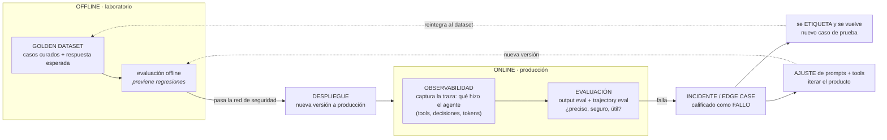

# Evaluación y Observabilidad de Agentes de IA

> **Síntesis.** La sesión anterior estableció *por qué* el monitoreo clásico no basta para la IA. Esta baja un nivel: *qué* se evalúa exactamente y *dónde*. Dos ejes ordenan todo. El primero es **qué miras**: el **output eval** juzga solo la respuesta final —¿el resultado es "42"?—, mientras que el **trajectory eval** revisa el procedimiento paso a paso —¿llamó a la API correcta, sin 50 consultas inútiles, extrayendo bien las fechas?—. Un agente puede acertar el resultado por las razones equivocadas, y mirar solo el final oculta esas fallas. El segundo eje es **dónde mides**: las evaluaciones **offline** corren en el laboratorio con *golden datasets* para frenar regresiones antes de desplegar; las **online** vigilan producción con usuarios reales y capturan los *edge cases* que ningún dato sintético anticipó. Ambos ejes se cierran en un **ciclo de mejora continua**: la observabilidad captura un incidente real, la evaluación lo califica como fallo, y ese fallo se etiqueta y se reintegra al dataset offline para que no vuelva a ocurrir. El cierre es una lista de **banderas rojas** —confundir logs con observabilidad, ignorar la trayectoria, vivir de datos sintéticos, sacrificar calidad por costo, y confiar a ciegas en un LLM-juez sin calibración humana—.

## Introducción

La sesión 1 nos dejó con un marco mental: el monitoreo tradicional crea una **ilusión operativa**, las fallas de IA son **silenciosas**, y necesitamos combinar **observabilidad** (qué pasó) con **evaluación** (si fue bueno), organizadas en un stack de cuatro capas. Pero quedó una pregunta abierta: cuando decimos "evaluar la calidad", ¿qué estamos mirando exactamente, y en qué momento del ciclo de vida del agente?

Esta clase responde con dos distinciones operativas que estructuran toda estrategia de validación seria. La primera separa **qué** evaluamos: ¿solo el resultado final, o también el camino que el agente recorrió para llegar a él? La segunda separa **dónde** evaluamos: ¿en el laboratorio, antes de desplegar, o en producción, con usuarios reales? De la combinación de ambas nace el **ciclo de mejora continua**, que es el verdadero motor de la ingeniería de IA confiable: una máquina que convierte fallos de producción en pruebas que blindan el futuro.

Es una clase conceptual y breve. Las próximas sesiones prácticas instrumentarán *tracing* para capturar la telemetría de nuestros agentes y escribirán scripts de evaluación que califiquen tanto el output como la trayectoria. Este es el mapa mental que hará que ese código tenga sentido.

## Objetivos de aprendizaje

1. **Diferenciar** la evaluación del resultado final (*output eval*) de la evaluación de la trayectoria (*trajectory eval*) para diagnosticar fallas ocultas en el razonamiento de un agente.
2. **Comparar** los enfoques de evaluación *offline* (laboratorio) y *online* (producción) para diseñar una estrategia de validación integral de extremo a extremo.
3. **Justificar** la necesidad de combinar métricas de software tradicionales con evaluaciones de calidad probabilística.
4. **Integrar** observabilidad y evaluación en un ciclo de mejora continua que transforme incidentes reales en nuevos conjuntos de datos de prueba.
5. **Identificar** las "banderas rojas" críticas de la ingeniería con IA, incluida la dependencia exclusiva de datos sintéticos y la falta de calibración humana en jueces LLM.

## Marco conceptual

### Observabilidad y evaluación: el repaso operativo

Antes de avanzar, fijemos las dos disciplinas como las usaremos hoy, ya en términos de implementación:

- La **observabilidad** monitorea el **comportamiento técnico** y la **telemetría interna**: provee el contexto detallado de cada interacción —las **trazas**, las herramientas usadas, las decisiones tomadas—. Es la materia prima.
- La **evaluación** es el proceso que **califica** esas ejecuciones: determina si los resultados son **precisos, seguros y útiles** para el usuario. Es el juicio sobre la materia prima.

Son complementarias pero distintas. La observabilidad **captura**; la evaluación **califica**. Sin la primera, la segunda no tiene qué juzgar; sin la segunda, la primera es solo datos sin veredicto. Toda la clase se construye sobre cómo se combinan estas dos.

### Output eval vs. trajectory eval: la analogía del examen de matemáticas

La distinción más importante de la clase es **qué** evaluamos. Imagina un examen de matemáticas en la escuela:

- El **output eval** es el profesor que solo mira si la respuesta al final de la hoja es **"42"**. Correcto o incorrecto, sin más.
- El **trajectory eval** es el profesor que revisa el **procedimiento paso a paso**.

¿Por qué importa el procedimiento si el resultado es correcto? Porque un estudiante —o un agente— puede llegar a "42" **copiando, adivinando, o cometiendo dos errores que se anulan entre sí**. El resultado es correcto, pero el proceso es un desastre. Evaluar solo el final **oculta fallas graves de razonamiento** que estallarán en cuanto cambie el problema.

Llevado a un agente de IA, enfocarse solo en el output eval esconde problemas severos:

- **Desperdicio masivo de tokens** —llegó a la respuesta, pero gastando 10× lo necesario—.
- **Recuperación de evidencia incorrecta** de la base de datos —acertó por casualidad, no porque el contexto fuera bueno—.
- **Alucinaciones intermedias** que, de chiripa, derivaron en una respuesta aceptable.

El ejemplo canónico es **reservar un vuelo**:

| | Output eval | Trajectory eval |
|---|---|---|
| **Qué verifica** | ¿Se reservó el vuelo? | ¿*Cómo* llegó a reservarlo? |
| **Preguntas concretas** | El resultado final, sí/no | ¿Buscó en la **API correcta**? ¿Evitó **50 llamadas innecesarias** a la base de datos? ¿Extrajo bien **las fechas** del prompt antes de actuar? |
| **Qué falla detecta** | El destino equivocado | El camino equivocado hacia el destino correcto |
| **Analogía del examen** | La respuesta "42" al pie de la hoja | El procedimiento paso a paso |

La conclusión: un agente puede dar la **respuesta final correcta por los motivos equivocados**. El trajectory eval es lo que distingue un acierto robusto de un acierto afortunado, y solo es posible si la observabilidad capturó la traza completa (de ahí que ambas disciplinas se necesiten).

### Offline vs. online: la analogía cambia de momento, no de lugar

El segundo eje es **dónde y cuándo** evaluamos. Las dos fases deben **coexistir**:

- **Evaluación offline** — Ocurre en el **entorno de desarrollo** (el laboratorio), usando **datasets curados** o *golden datasets* (datos de oro): un conjunto de casos con su respuesta esperada. Su propósito es **prevenir regresiones** —que una versión nueva degrade respuestas que antes funcionaban— **antes** de desplegar. Es la red de seguridad previa a producción.
- **Evaluación online** — Monitorea el sistema **directamente en producción**, con interacciones **reales** de usuarios. Permite detectar **fallos emergentes** y comportamientos imprevistos —los *edge cases*— que los datos sintéticos jamás anticiparon, porque el usuario real es impredecible.

| | Offline | Online |
|---|---|---|
| **Dónde** | Laboratorio / desarrollo | Producción |
| **Con qué datos** | *Golden datasets* curados | Interacciones reales de usuarios |
| **Propósito** | Prevenir regresiones antes de desplegar | Capturar *edge cases* y fallos emergentes |
| **Rol** | Red de seguridad previa | Vigilancia continua en vivo |
| **Limitación** | No anticipa la imprevisibilidad real | Detecta el fallo cuando ya ocurrió |

Ninguna sustituye a la otra. La offline te protege de romper lo que ya funcionaba; la online te muestra lo que nunca imaginaste que probar. La potencia surge cuando se conectan.

### El ciclo de mejora continua

Aquí es donde observabilidad y evaluación, offline y online, se funden en un solo motor. El núcleo del éxito en la ingeniería de IA es un **ciclo** de cuatro tiempos:

1. **La observabilidad captura** un incidente real en producción: *qué hizo* el agente (su traza completa).
2. **La evaluación lo califica** negativamente: *falló* en su tarea.
3. Ese fallo documentado se **etiqueta y se convierte en un nuevo caso**, que se añade a un **dataset estructurado** (el golden dataset offline).
4. Los desarrolladores **ajustan prompts y herramientas** e iteran, de modo que **ese error no vuelva a ocurrir** —y queda blindado como prueba de regresión permanente—.

La idea clave es que un *edge case* capturado en **online** se reintegra al dataset **offline**. El fallo de hoy es la prueba de regresión de mañana. Así el agente no solo se arregla puntualmente: se vuelve **medible y a prueba de recaídas**. La observabilidad sin evaluación es ciega; la evaluación sin reintegración es estéril; juntas y en ciclo, refinan el producto iterativamente.

Leído como ciclo: el **golden dataset** alimenta la **evaluación offline**, que actúa de red de seguridad antes del **despliegue**. Ya en **producción**, la **observabilidad** captura las trazas y la **evaluación** (output + trajectory) las califica. Cuando algo **falla**, ese *edge case* se **etiqueta**, se **reintegra al golden dataset** —para que la próxima evaluación offline lo cubra— y dispara un **ajuste** de prompts y herramientas. El error de producción se convierte, literalmente, en el siguiente caso de prueba.

### Métricas tradicionales vs. banderas rojas en IA

Cerramos con la diferenciación práctica entre el monitoreo de software tradicional y las necesidades reales de la IA. Combinar **métricas clásicas** (latencia, costo, errores) con **evaluación de calidad probabilística** es obligatorio: ninguna sola garantiza respuestas precisas, seguras y útiles. Y al construir, hay que vigilar estas **banderas rojas** —los errores críticos más comunes—:

1. **Confundir logs de texto con observabilidad real.** Imprimir mensajes básicos *no* es observabilidad; se requieren **trazas estructuradas paso a paso** del razonamiento.
2. **Ignorar la trayectoria** y mirar solo el output. Un agente puede dar la respuesta correcta **por los motivos equivocados** o desperdiciando tokens —y nunca lo sabrás sin trajectory eval—.
3. **Depender exclusivamente de datos sintéticos** generados por IA, sin revisión humana, ignorando la imprevisibilidad del usuario real.
4. **Optimizar costo o latencia a expensas de la calidad** de la respuesta. Un agente barato y rápido que responde mal no sirve.
5. **Confiar a ciegas en un LLM como juez** (*LLM-as-a-judge*) sin **calibración humana periódica**.

La quinta merece su propia sección, porque es la más sutil.

### LLM-as-a-judge: poderoso, pero requiere calibración humana

Usar un LLM para calificar las salidas de otro LLM (*LLM-as-a-judge*) es una técnica central para escalar la evaluación —ningún equipo humano puede revisar millones de respuestas a mano—. Pero tiene un riesgo que la literatura académica documenta bien: los jueces LLM cargan **sesgos y limitaciones** (favoritismo por respuestas más largas, por cierto estilo, por su propia familia de modelos, sensibilidad al orden de presentación).

El punto crítico para producción es la **deriva temporal**: los **modelos subyacentes evolucionan y cambian sus criterios con el tiempo**. Un juez que hoy califica bien puede, tras una actualización del modelo, desplazar silenciosamente su vara de medir —y tus métricas dejarían de significar lo mismo sin que nada lo avise—. Por eso la **calibración humana periódica es innegociable**: auditar cada cierto tiempo una muestra de los juicios del LLM contra el criterio de un humano, para confirmar que el juez sigue alineado. El LLM-juez escala el trabajo; el humano mantiene la vara honesta.

## Síntesis

Evaluar un agente de IA exige responder dos preguntas que el monitoreo clásico ni siquiera plantea. **Qué** evaluar: el **output eval** mira solo el resultado —el "42" al pie de la hoja— mientras que el **trajectory eval** revisa el procedimiento, revelando aciertos por los motivos equivocados, tokens desperdiciados o evidencia mal recuperada. **Dónde** evaluar: las pruebas **offline** usan *golden datasets* en el laboratorio para frenar regresiones antes de desplegar, y las **online** vigilan producción con usuarios reales para cazar los *edge cases* impredecibles. Ambas se cierran en el **ciclo de mejora continua**: la observabilidad captura el incidente, la evaluación lo declara fallo, el caso se etiqueta y se reintegra al dataset offline, y se ajustan prompts y herramientas —el error de hoy se vuelve la prueba de regresión de mañana—. Todo bajo la vigilancia de las **banderas rojas**: logs no son observabilidad, no ignores la trayectoria, no vivas de datos sintéticos, no sacrifiques calidad por costo, y nunca confíes en un **LLM-juez sin calibración humana periódica**, porque los modelos derivan y su criterio cambia. Las próximas clases convierten este mapa en *tracing* y scripts de evaluación reales.

## Preguntas de repaso

1. Explica la analogía del examen de matemáticas. ¿Qué representa el "42" y qué representa el procedimiento? ¿Por qué un resultado correcto puede esconder un proceso pésimo?
2. En el ejemplo de reservar un vuelo, da dos cosas que el *output eval* **no** detectaría pero el *trajectory eval* sí. ¿Por qué el trajectory eval depende de tener buena observabilidad?
3. Diferencia evaluación *offline* y *online*: ¿dónde corre cada una, con qué datos y para qué sirve? ¿Por qué se dice que no pueden sustituirse mutuamente?
4. ¿Qué es un *golden dataset* y qué rol juega en prevenir regresiones?
5. Describe el ciclo de mejora continua en sus cuatro pasos. ¿Cómo se conecta un *edge case* capturado en **online** con el dataset **offline**?
6. Enumera al menos cuatro "banderas rojas" de la ingeniería con IA y explica brevemente por qué cada una es peligrosa.
7. ¿Por qué la calibración humana de un *LLM-as-a-judge* es "innegociable"? ¿Qué problema concreto surge del hecho de que los modelos subyacentes evolucionen con el tiempo?

## Recursos

- [LangSmith — Evaluación y observabilidad](https://docs.smith.langchain.com/evaluation) — guía oficial para definir datasets, correr evaluaciones offline/online y trazar la trayectoria de agentes.
- [Judging LLM-as-a-Judge with MT-Bench and Chatbot Arena (Zheng et al., 2023)](https://arxiv.org/abs/2306.05685) — artículo académico sobre las limitaciones y sesgos de usar LLMs como jueces (sesgo de posición, de verbosidad, de auto-preferencia).
- Conexión interna: [Observabilidad y Evaluación en Sistemas de IA](./01-observabilidad-y-evaluacion-en-sistemas-de-ia.md) — la sesión 1, que establece la ilusión operativa, el vibe check y el stack de calidad de 4 capas sobre el que esta clase profundiza.
- Conexión interna: [Fundamentos de Memoria a Largo Plazo en Agentes de IA](../week-06/04-long-term-memory-fundamentals.md) — la recuperación de documentos que el *trajectory eval* debe verificar (¿se trajo la evidencia correcta?).

## Notas personales

<!-- Observaciones propias, conexiones con otros temas, ideas. -->
