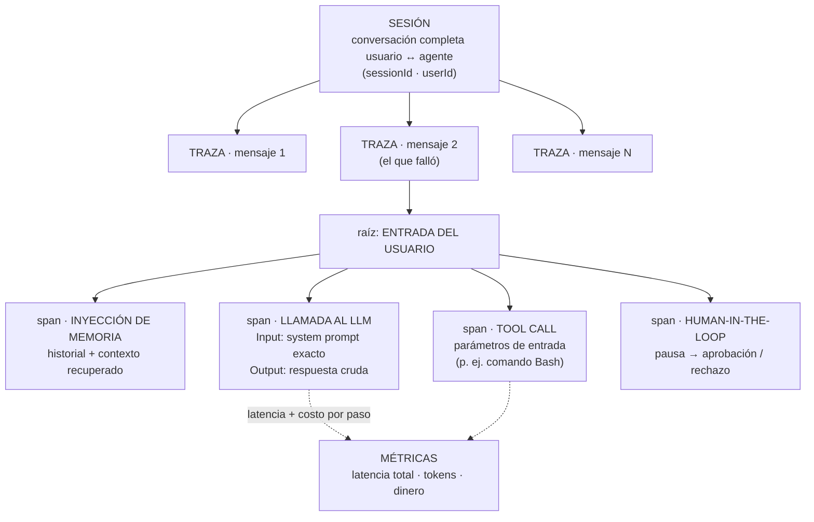

# Tracing y Observabilidad de Agentes de IA con Langfuse

> **Síntesis.** La sesión anterior enchufó Langfuse al agente; esta enseña a *leer* lo que Langfuse captura. La tesis: la **observabilidad es el paso fundamental y previo a la evaluación** —primero hay que *ver* qué hizo el agente antes de poder juzgar si lo hizo bien—. Desarrollar sin ella es pilotar un avión con los ojos vendados; el dashboard de Langfuse es el tablero de instrumentos que convierte ese vuelo a ciegas en un panel navegable. Su unidad organizativa es una jerarquía de tres niveles: la **sesión** (una conversación completa) contiene **trazas** (una por cada mensaje respondido), y cada traza se descompone en **observaciones** o **spans** (los pasos internos: inyección de memoria, llamada al LLM, tool calls, interrupciones human-in-the-loop). Esa jerarquía es la que habilita el **debugging reactivo**: partir de una queja concreta, localizar la sesión, abrir la traza del mensaje que falló, desplegar el árbol de ejecución e inspeccionar el system prompt exacto, la respuesta cruda del modelo y los parámetros de cada herramienta —sin leer un solo log en texto plano—.

## Introducción

El arco de la semana ya está casi cerrado. La sesión 1 nos dio el diagnóstico —la ilusión operativa, las fallas silenciosas, el stack de calidad de cuatro capas—; la sesión 2 el mapa de la evaluación —output vs. trajectory, offline vs. online, el ciclo de mejora continua—; y la sesión 3 la instalación práctica —enganchar el `CallbackHandler` de Langfuse a un grafo de LangGraph para pasar de caja negra a caja blanca—. Pero instrumentar la captura no es lo mismo que saber interpretarla: teníamos un dashboard lleno de datos y ninguna disciplina para navegarlo.

Esta clase es esa disciplina. Asume que las trazas ya se están registrando y se concentra en el **flujo de depuración reactiva**: qué mirar, en qué orden, y cómo bajar desde una queja vaga de usuario —"el agente respondió cualquier cosa"— hasta la línea exacta del system prompt o el parámetro de la herramienta que causó el fallo. El escenario típico es reactivo por definición: algo salió mal en producción y hay que reconstruir *por qué* a partir de lo que el agente dejó registrado.

Conviene fijar el matiz que gobierna toda la sesión: la observabilidad **precede** a la evaluación. Ver lo que hizo el agente (esta clase) es el prerrequisito de calificar si estuvo bien (la clase 2). No se puede evaluar lo que no se puede ver. Por eso el dashboard de Langfuse no es un lujo de monitoreo, sino la materia prima sobre la que después se monta cualquier estrategia de validación seria.

## Objetivos de aprendizaje

1. **Explicar** el rol de la observabilidad y la trazabilidad como fundamentos indispensables y previos a la evaluación de agentes de IA.
2. **Diferenciar** los conceptos de *sesión*, *traza* y *observación* para interpretar la jerarquía de ejecución de un agente en el dashboard.
3. **Analizar** el comportamiento y el rendimiento de un agente mediante métricas clave: latencia, costos y uso por usuario.
4. **Depurar** errores en el flujo inspeccionando el system prompt, las llamadas al LLM y las interrupciones human-in-the-loop.
5. **Integrar** plataformas de observabilidad como Langfuse en proyectos propios para lograr transparencia y control continuo del comportamiento del agente.

## Marco conceptual

### ¿Qué es la observabilidad en IA?

La **observabilidad** es la capacidad de medir, registrar y entender el **estado interno** de un sistema —aquí, un agente— a partir de los datos que produce en sus salidas y en sus registros de ejecución. No se trata solo de saber *si* respondió, sino de reconstruir *cómo*, *cuándo* y *por qué* tomó cada decisión en el camino. Es la disciplina que da transparencia sobre el proceso, no solo sobre el resultado.

El punto que ordena toda la sesión es su lugar en la secuencia: la observabilidad es el **paso fundamental y previo a cualquier evaluación de calidad**. Antes de poder afirmar que una respuesta fue precisa, segura o útil, hay que poder *ver* la ejecución completa que la produjo. Sin ese registro, evaluar es adivinar. La observabilidad captura; la evaluación —tema de la sesión 2— califica sobre lo capturado. Por eso el orden importa: primero se ilumina la caja, después se la juzga.

### El tablero de vuelo: la analogía del avión

La imagen mental de la clase es la cabina de un avión. Desarrollar un agente **sin observabilidad** es pilotar con los ojos vendados y sin instrumentos: no conoces tu velocidad, ni cuánto combustible queda, ni si te diriges a una montaña. El avión vuela —el agente responde—, pero cualquier anomalía es invisible hasta que se convierte en catástrofe. Es la misma "ilusión operativa" de la sesión 1: todo parece funcionar porque no hay nada que contradiga esa impresión.

Langfuse es el **tablero de instrumentos** de esa cabina. Muestra las métricas vitales del vuelo —costo, latencia, uso por usuario— de un vistazo, y permite hacer *zoom* sobre cualquier lectura anómala mientras el avión sigue en el aire. Ese "zoom en vuelo" es precisamente el **debugging reactivo**: no esperas a que el sistema se estrelle para investigar; detectas el pico de latencia o el gasto inesperado de tokens y bajas al detalle en caliente. El tablero no vuela el avión por ti, pero sin él vuelas a ciegas.

### Sesiones y Trazas

La observabilidad de un agente se organiza en niveles anidados, y los dos más altos son la sesión y la traza. Una **sesión** (*session*) es el hilo identificador de una **conversación completa** entre un usuario y el agente: puede contener múltiples mensajes de ida y vuelta distribuidos en el tiempo. Es la unidad que responde a la pregunta "¿qué pasó en toda esta charla?". Cuando un usuario reporta un problema, el punto de entrada natural es su sesión, porque agrupa todo el contexto del intercambio.

Dentro de una sesión, una **traza** (*trace*) es el conjunto de llamadas y procesos internos necesarios para responder a **un solo mensaje**. Si la sesión es la conversación entera, la traza es el "expediente" de un turno concreto: la pregunta del usuario, todo lo que el agente hizo por dentro para resolverla, y la respuesta final. Una sesión con cinco intercambios contiene cinco trazas. Esta separación es la que permite aislar el turno exacto que falló sin perderse en el ruido del resto de la conversación.

### Observaciones y Spans: vista jerárquica

Una traza no es un bloque monolítico. Por dentro se descompone en una jerarquía de **observaciones** —también llamadas **spans**—, los nodos hijos que documentan el **paso a paso exacto** de la ejecución. Cada span registra un momento discreto del razonamiento del agente: la **inyección de memoria** o historial de la conversación, la **llamada al LLM** con su prompt y su respuesta, la **ejecución de herramientas externas** (una búsqueda web, un comando de terminal) y, cuando existe, la **interrupción human-in-the-loop** en la que el agente se detiene a pedir confirmación. Los spans se anidan formando un árbol cuya raíz es la entrada del usuario.

Esta granularidad es la que hace posible medir **latencia, costo y comportamiento por paso**, no solo por respuesta —y es, además, el prerrequisito directo del *trajectory eval* de la sesión 2: sin spans, solo podrías juzgar el output final; con ellos, puedes auditar el camino completo—. El diagrama siguiente resume la jerarquía de tres niveles.

Leído de arriba hacia abajo: la **sesión** agrupa varias **trazas**, una por mensaje; abrir la traza del mensaje problemático despliega su **árbol de observaciones/spans**, cuya raíz es la entrada del usuario y cuyos hijos detallan la inyección de memoria, la llamada al LLM (con el system prompt en el Input y la respuesta cruda en el Output), las tool calls con sus parámetros y las pausas human-in-the-loop. Cada span aporta además sus propias métricas de latencia y costo.

### Anatomía de una traza en el dashboard

Al abrir una traza en Langfuse, la información se presenta en tres bloques que conviene reconocer. Primero, los **metadatos generales**: el ID de la traza, el usuario asociado y el *timestamp* —lo que permite correlacionar la traza con la queja concreta de un usuario y un momento—. Segundo, las **métricas de rendimiento**: la **latencia** total del turno y su **costo**, medido tanto en tokens como en dinero; son las lecturas que delatan una anomalía (un pico de latencia, un consumo desproporcionado) y que en agregado alimentan el análisis por usuario.

Tercero, y es el corazón de la vista, el **árbol de ejecución**: una lista desplegable donde el **nodo raíz** es la entrada del usuario y los **hijos** detallan cada paso —el system prompt que se envió al modelo, la respuesta cruda del LLM antes de ser procesada por el agente, y las llamadas a herramientas con sus parámetros—. Navegar ese árbol, expandiendo y contrayendo nodos, es literalmente el acto de depurar: cada clic revela un dato que antes vivía enterrado en la lógica del agente.

### Langfuse y su rol en el ecosistema

**Langfuse** es una plataforma de observabilidad **open source** para aplicaciones basadas en LLMs, comparable a alternativas como **LangSmith** o **Braintrust** pero con la ventaja de ser de código abierto y self-hosteable. Se integra con frameworks como **LangGraph** —la mecánica que montamos en la sesión 3 vía `CallbackHandler`— y captura la telemetría del agente **en tiempo real**, presentándola en un panel interactivo.

Su valor práctico es doble: facilita el **debugging reactivo** —bajar de un síntoma a su causa raíz navegando trazas y spans— y el **análisis de costos** —entender dónde se van los tokens y el dinero— sin obligar a revisar logs en texto plano. Frente a imprimir mensajes por consola, el dashboard estructurado convierte un problema de arqueología textual en uno de navegación visual: la diferencia entre buscar una aguja en un pajar de líneas de log y hacer clic en el nodo que ya sabes que falló.

### ⚠️ Advertencias

Dos matices gobiernan el uso correcto de la observabilidad. El primero es conceptual y es el más importante: **observabilidad no es evaluación**. Ver lo que hace el agente —el terreno de esta clase— es distinto de determinar si lo que hizo es correcto o útil —el terreno de la [sesión 2](./02-evaluation-and-observability-of-ai-agents.md)—. La observabilidad por sí sola no asegura control de calidad; es la materia prima, no el veredicto. Confundir "tengo trazas bonitas" con "mi agente funciona bien" es un espejismo: el dashboard te muestra el proceso, pero calificarlo sigue siendo un paso aparte.

El segundo es operativo: conviene **integrar la observabilidad en etapas tempranas** del proyecto. La telemetría que no se capturó no se puede recuperar después; cada día sin instrumentación es histórico perdido —justo los datos que más valen cuando aparece un incidente y necesitas reconstruir el pasado—. Instrumentar temprano es barato; hacerlo tarde significa depurar a ciegas los primeros y más caóticos meses de vida del agente.

## Guía práctica

### Flujo de depuración reactiva en Langfuse

El objetivo de esta guía es un procedimiento reactivo: partir de un síntoma —una interacción que salió mal— y descender metódicamente hasta la causa raíz. El recorrido asume que el agente ya está conectado a Langfuse (sesión 3) y va de lo general (la sesión del usuario) a lo específico (el parámetro de una herramienta o una línea del system prompt).

#### Preparación

1. Inicia sesión en Langfuse y entra al panel principal.
2. Selecciona el **proyecto** que tiene el agente conectado.
3. Verifica que el **Dashboard** muestre gráficos con datos recientes de **latencia**, **costos** y **uso por usuario** —si está vacío, revisa la integración de la sesión 3 antes de continuar (recuerda: las trazas se pierden en silencio si las credenciales no coinciden)—.

#### Paso 1 — Identificar la interacción problemática (Sessions)

1. Abre la pestaña **Sessions** del menú lateral.
2. Haz clic en el **ID de la sesión** reportada con errores o comportamiento inesperado.
3. Recorre el hilo de la conversación y **localiza el mensaje** que falló.
4. Abre su **Trace** (traza) para bajar del nivel conversación al nivel turno.

#### Paso 2 — Desglosar la traza y sus spans

1. Revisa primero el **panel de métricas superior**: busca un pico de latencia o un consumo anómalo de tokens que señale dónde está el problema.
2. Despliega el **árbol jerárquico** de spans (con los iconos `+` o las flechas junto a cada nodo).
3. Verifica la **secuencia esperada** de la ejecución: inyección de memoria → llamadas al LLM → uso de herramientas. Un paso ausente, repetido o fuera de orden ya es una pista.

#### Paso 3 — Inspección del System Prompt y el LLM (Input / Output)

1. Haz clic en el nodo de **LLM Call / Generation**.
2. En **Input**, revisa el **system prompt exacto** que recibió el modelo —no el que creíste enviar, sino el que efectivamente llegó—.
3. Analiza el **orden de las instrucciones**: muchos fallos vienen de instrucciones contradictorias o mal secuenciadas que confundieron al modelo.
4. En **Output**, examina la **respuesta cruda del LLM**, tal como salió del modelo antes de que el agente la procesara. Comparar Input contra Output aísla si el error fue del prompt o del propio modelo.

#### Paso 4 — Monitoreo de herramientas y human-in-the-loop

1. Localiza los nodos de **Tool Calls** (por ejemplo, comandos Bash).
2. Haz clic para ver los **parámetros de entrada**: qué comando o consulta intentó ejecutar exactamente el agente.
3. Si el agente usa confirmación humana, busca el nodo de **interrupción human-in-the-loop** —el punto donde el agente se pausa a pedir permiso—.
4. Verifica que el sistema **registró la pausa** y la posterior **aprobación o rechazo** del usuario; una interrupción mal registrada explica por qué un agente "se quedó colgado" o ejecutó algo que debía confirmar.

#### Paso 5 (opcional) — Iteración y mejora continua

1. Con la causa raíz ya identificada —un prompt confuso, una herramienta mal parametrizada—, **ajusta el código fuente** del agente.
2. **Ejecuta una nueva prueba** con el mismo escenario que falló.
3. Vuelve a Langfuse, busca la **nueva traza** y comprueba que el error se corrigió y el comportamiento es el esperado.

Este último paso es la bisagra con la sesión 2: la traza que confirma el arreglo puede etiquetarse y reintegrarse a un *golden dataset* como caso de regresión, cerrando el ciclo de mejora continua. La observabilidad detectó el fallo; la evaluación lo blinda para que no vuelva.

## Síntesis

Con esta sesión se cierra el arco de la semana. Empezamos con el diagnóstico —la ilusión operativa y el stack de cuatro capas (s1)—, seguimos con el mapa de la evaluación —output vs. trajectory, offline vs. online, el ciclo de mejora continua (s2)—, instrumentamos la captura —enganchar Langfuse a LangGraph para volver el agente una caja blanca (s3)— y ahora aprendimos a **leer** lo que esa caja blanca revela. El mensaje central es de orden: la **observabilidad es el paso previo e indispensable a la evaluación**; primero se ve, después se juzga. Langfuse es el tablero de instrumentos que reemplaza el vuelo a ciegas, y su lenguaje es una jerarquía de tres niveles —**sesión → traza → observaciones/spans**— que habilita el **debugging reactivo**: de una queja de usuario se baja a la sesión, de ahí a la traza del mensaje que falló, y de ahí al árbol de spans donde el system prompt exacto, la respuesta cruda del LLM, los parámetros de las herramientas y las pausas human-in-the-loop quedan al descubierto. Ver ya no es adivinar. Y una vez que se ve el fallo, la evaluación —y su golden dataset— puede convertirlo en la prueba de regresión de mañana.

## Preguntas de repaso

1. Explica por qué se dice que la observabilidad es "el paso previo a la evaluación". ¿Qué hace la observabilidad que la evaluación no puede hacer sin ella, y viceversa?
2. Diferencia **sesión**, **traza** y **observación/span** con un ejemplo concreto: una conversación de tres mensajes en la que el segundo falló. ¿Cuántas trazas hay y dónde buscarías el error?
3. Desarrolla la analogía del tablero de vuelo. ¿Qué representa volar con los ojos vendados y qué significa hacer "zoom en vuelo"? Relaciónalo con el término *debugging reactivo*.
4. Estás depurando una respuesta incorrecta. Describe en orden el flujo reactivo desde la pestaña Sessions hasta la inspección del system prompt. ¿Por qué se revisa el **Input** (system prompt) y el **Output** (respuesta cruda) por separado?
5. ¿Qué es una interrupción **human-in-the-loop** y qué esperarías ver registrado en su span? ¿Por qué su ausencia o mal registro es relevante al depurar?
6. Un compañero afirma: "mi dashboard de Langfuse está lleno de trazas limpias, así que mi agente funciona bien". ¿Qué error conceptual comete y qué sesión de la semana lo desmiente?

## Recursos

- [Langfuse — Documentación oficial](https://langfuse.com/docs) — referencia central de la plataforma: conceptos de tracing (sessions, traces, observations/spans), navegación del dashboard, métricas de latencia y costo, y análisis por usuario.
- Conexión interna: [Observabilidad y Evaluación en Sistemas de IA](./01-observability-and-evaluation-in-ai-systems.md) — la sesión 1, que estableció la ilusión operativa, las fallas silenciosas y el stack de calidad de 4 capas donde la trazabilidad es la capa que esta clase enseña a leer.
- Conexión interna: [Evaluación y Observabilidad de Agentes de IA](./02-evaluation-and-observability-of-ai-agents.md) — la sesión 2, que aclara la frontera entre *ver* (observabilidad) y *calificar* (evaluación) y define el ciclo de mejora continua que este flujo reactivo alimenta.
- Conexión interna: [Integración de Langfuse en Agentes de LangGraph](./03-langfuse-integration-langgraph-agents.md) — la sesión 3, que instrumentó la captura (Docker, env vars, `CallbackHandler`) y produjo las trazas que aquí aprendemos a navegar.